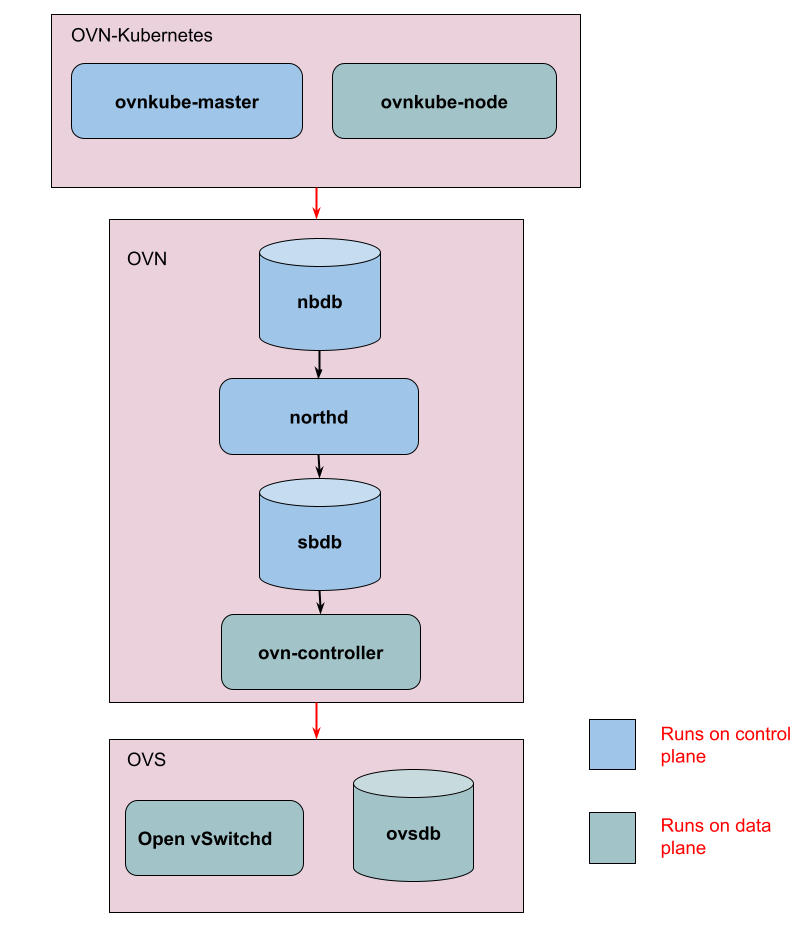
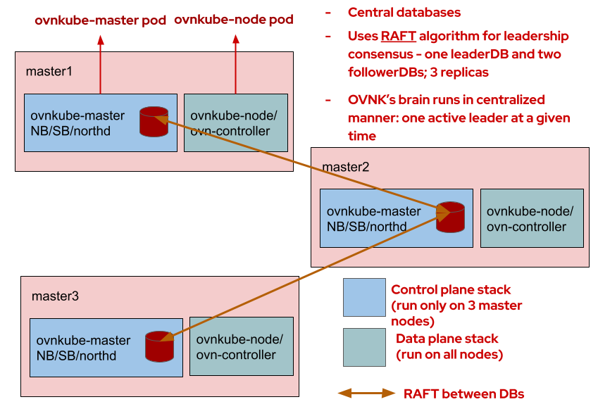
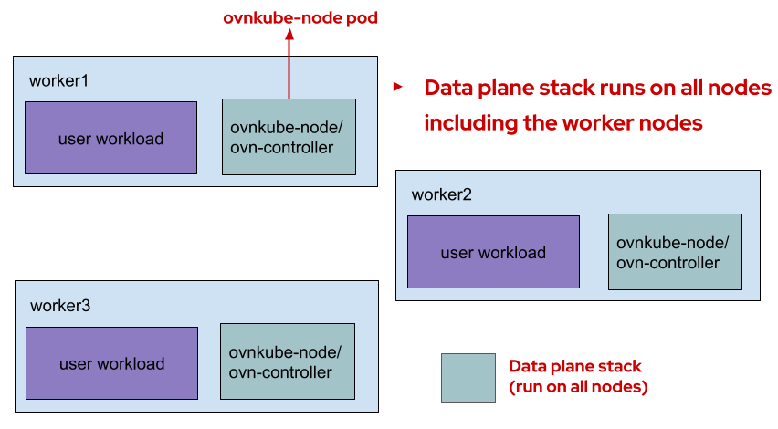
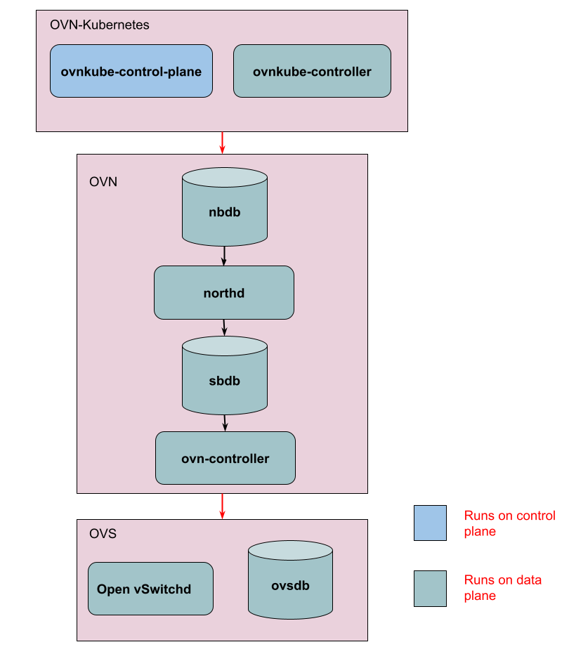
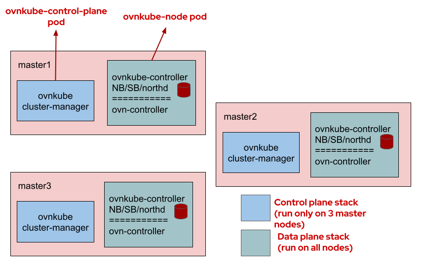
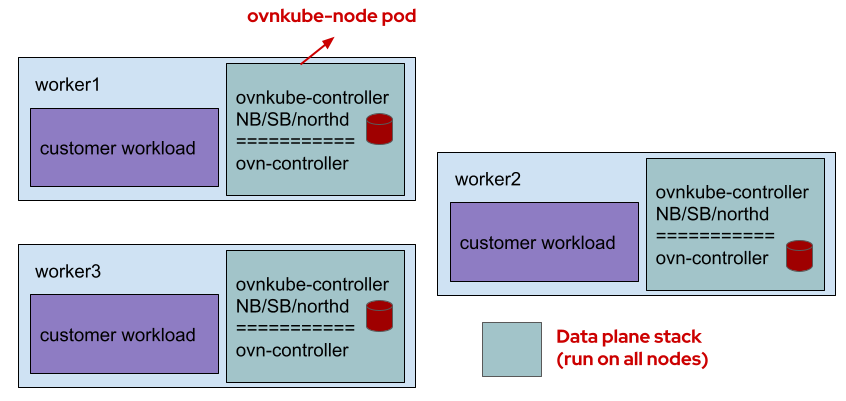

# OVN Kubernetes Architecture

There are two deployment modes for ovn kubernetes depending on
which the architecture is drastically different:

* default mode (centralized control plane architecture)
* interconnect mode (distributed control plane architecture)

End users can pick either of these modes depending on their use
cases and what suits them well. Let's look at both these modes
in depth so that you are empowered to make your choice between
these two modes of deployment.

## OVN Kubernetes Components - Default Mode

The control plane has the `ovnkube-master` pod in the `ovn-kubernetes` namespace
which are running only on the control plane nodes in your cluster:

* ovnkube-master pod
    * ovnkube-master container:
        * OVN-Kubernetes component
        * Watches K8s API for objects - namespaces, pods, services, endpoints,
        network policies, CRs
        * Translates K8s objects into OVN logical entities
        * Stores OVN entities in NorthBound Database (NBDB)
        * Manages pod subnet allocation to nodes (pod IPAM)
    * nbdb container:
        * Native OVN component
        * Runs the OVN NBDB database
        * Stores the logical elements created by ovnkube-master
        * 3 replicas across control plane nodes running using RAFT leadership
        algorithm in HA mode
    * northd container:
        * Native OVN component
        * Converts the OVN logical elements from NBDB to OVN logical flows in SBDB
    * sbdb container:
        * Native OVN component
        * Stores the logical flows created by northd
        * 3 replicas across control plane nodes running using RAFT leadership algorithm
        in HA mode

The data plane includes the `ovnkube-node` and `ovs-node` pods in the `ovn-kubernetes`
namespace which are running on all your nodes in the cluster.

* ovnkube-node pod
    * ovnkube-node container:
        * OVN Kubernetes component
        * Runs the CNI executable (CNI ADD/DEL)
        * Digests the IPAM annotation set on pod by ovnkube-master
        * Creates the veth pair for the pod
        * Creates the ovs port on bridge
        * Programs the necessary iptables and gateway service flows on a per-node basis.
    * ovn-controller container:
        * Native OVN component
        * Connects to SBDB running in control plane using TLS
        * Converts SBDB logical flows into openflows
        * Write them to OVS
* ovs-node pod
    * ovs-daemons container:
        * OVS Native component
        * OVS daemon and database running as a container
        * virtual switch that pushes the network plumbing to the edge on the node

## Default Mode Architecture

Now that we know the pods and components running in the default mode, let's tie up
loose ends and show how these components run on a standard HA Kubernetes cluster.

### Control Plane Nodes:

### Worker Nodes:

## OVN Kubernetes Components - Interconnect mode

The control plane has the `ovnkube-control-plane` pod in the `ovn-kubernetes` namespace
which is super lightweight and running only on the control plane nodes in your cluster:

* ovnkube-control-plane pod
    * ovnkube-cluster-manager container:
        * OVN-Kubernetes component
        * Watches K8s API for objects - nodes mainly
        * Allocates pod subnet to each node
        * Allocates join subnet IP to each node
        * Allocates transit subnet IP to each node
        * Consolidates zone statuses across all nodes for features like EgressFirewall
        and EgressQoS

The data plane includes the `ovnkube-node` and `ovs-node` pods in the `ovn-kubernetes`
namespace running on all your nodes in the cluster making this architecture localized
and more distributed.

* ovnkube-node pod
    * ovnkube-controller container:
        * OVN-Kubernetes component
        * Allocates podIP from the podSubnet to each pod in its zone (IPAM)
        * Watches K8s API for objects - nodes, namespaces, pods, services, endpoints,
        network policies, CRs
        * Translates K8s objects into OVN logical entities - stores them in OVN databases
        * Stores OVN entities in NorthBound Database (NBDB)
        * Manages pod subnet allocation to nodes (pod IPAM)
        * Runs the CNI executable (CNI ADD/DEL)
        * Digests the IPAM annotation set on pod
        * Creates the veth pair for the pod
        * Creates the ovs port on bridge
        * Programs the necessary iptables and gateway service flows on a 
    * nbdb container:
        * Native OVN component
        * Runs the OVN NBDB database
        * Stores the logical elements created by ovnkube-controller
        * runs only 1 replica, contains information local to this node
    * northd container:
        * Native OVN component
        * Converts the OVN logical elements from NBDB to OVN logical flows in SBDB
    * sbdb container:
        * Native OVN component
        * Stores the logical flows created by northd
        * runs only 1 replica, contains information local to this node
    * ovn-controller container:
        * Native OVN component
        * Connects to SBDB running in control plane using TLS
        * Converts SBDB logical flows into openflows
        * Write them to OVS
* ovs-node pod
    * ovs-daemons container:
        * OVS Native component
        * OVS daemon and database running as a container
        * virtual switch that pushes the network plumbing to the edge on the node

As we can see, the databases, northd and ovn kubernetes controller components
now run per zone rather than only on the control-plane.

## Interconnect Mode Architecture

### What is Interconnect?

[OVN Interconnection](https://docs.ovn.org/en/latest/tutorials/ovn-interconnection.html)
is a feature that allows connecting multiple OVN deployments with OVN managed GENEVE tunnels.
Native ovn-ic feature allows for an `ovn-ic`, OVN interconnection controller, that is a
centralized daemon which communicates with global interaction databases (IC_NB/IC_SB) to
configure and exchange data with local NB/SB databases for interconnecting with other OVN
deployments. See [this](https://man7.org/linux/man-pages/man8/ovn-ic.8.html) for more details.

### Adopting OVN-Interconnect into OVN-Kubernetes

In order to effectively adapt the capabilities of the interconnect feature in the kubernetes
world, ovn-kubernetes components will replace `ovn-ic` daemon. Also note that the term `zone`
which will be used heavily in these docs just refers to a single OVN deployment. Now that we
know the pods and components running in the interconnect mode, let's tie up loose ends and
show how these components run on a standard HA Kubernetes cluster. By default, each node in
the cluster is a `zone`, so each `zone` contains 1 node. There is no more RAFT since each
node has its own database.

### Control Plane Nodes:

### Worker Nodes:

### Why do we need Interconnect mode in OVN-Kubernetes?

This architecture brings about several improvements:

* Stability: The OVN Northbound and Southbound databases are local to each node. Since
they are running in the standalone mode, that eliminates the need for RAFT, thus avoiding
all the “split-brain” issues. If one of the databases goes down, the impact is now isolated
to only that node. This has led to improved stability of the OVN Kubernetes stack and
simpler customer escalation resolution.
* Scale: As seen in the above diagram, the ovn-controller container connects to the
local Southbound database for logical flow information. On large clusters with N nodes,
this means each Southbound database is handling only one connection from its own local
ovn-controller. This has removed the scale bottlenecks that were present in the centralized
model helping us to scale horizontally with node count.
* Performance: The OVN Kubernetes brain is now local to each node in the cluster, and it is
storing and processing changes to only those Kubernetes pods, services, endpoints objects
that are relevant for that node (note: some features like NetworkPolicies need to process
pods running on other nodes). This in turn means the OVN stack is also processing less data
thus leading to improved operational latency. Another benefit is that the control plane
stack is now lighter-weight.
* Security: Since the infrastructure network traffic between ovn-controller and OVN Southbound
database is now contained within each node, overall cross-node and cross-cluster
(HostedControlPlane, ManagedSaaS) chatter is decreased and traffic security can be increased.

## Default Mode versus Interconnect Mode

* When you want your databases to stay centralized and don't mind much about linear scaling of number of nodes in your cluster, choose the default mode
* Note that there is no different to OVS between the two deployment modes.
* FIXME: This section needs to be written well