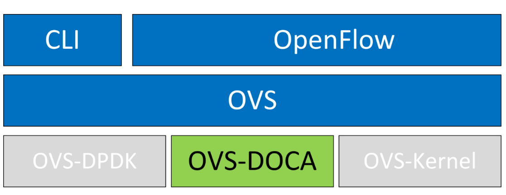

# OVS-DOCA

## Introduction

OVS supports [Hardware Acceleration features](https://docs.openvswitch.org/en/latest/howto/tc-offload/#flow-hardware-offload) which allows to offload OVS packet processing to the hardware (switch chassis, NIC etc.) while maintaining OVS control path (client facing apis and tools etc.) unmodified. It utilizes [Single Root-IO Virtualization (SR-IOV)](https://learn.microsoft.com/en-us/windows-hardware/drivers/network/overview-of-single-root-i-o-virtualization--sr-iov-) technology with [VF representor](https://docs.openvswitch.org/en/latest/topics/dpdk/phy/#representors) host net-device.

DOCA (Data Center Infrastructure-on-a-Chip Architecture) is a software stack for NVIDIA Smart NIC (ConnectX) and Data Processing Unit (BlueField) product lines. It contains a runtime and development environment, including libraries and drivers for device management and programmability, for the host (Smart NIC) or as part of the Data Processing Unit (DPU).

OVS-DOCA extends traditional OVS-DPDK and OVS-Kernel data-path offload interfaces (DPIF), adds  OVS-DOCA as an additional DPIF implementation. It preserves the same interfaces as OVS-DPDK and OVS-Kernel while utilizing the DOCA Flow library. OVS-DOCA uses unique hardware offload mechanisms and application techniques to maximize performance and adds other features. OVS Acceleration with kernel datapath is documented [here](https://ovn-kubernetes.io/features/hardware-offload/ovs_acceleration/)



## Motivation: Why use ovs-doca instead of ovs-dpdk

OVS-DOCA is also a userland based virtual switch application like OVS-DPDK. Like OVS-DPDK it uses DPDK and PMD (Poll Mode Driver). It preserves the existing north bound APIs (Openflow) and is a drop in replacement for upstream OVS. But the main difference is that OVS-DOCA uses the DOCA-flow api instead of the rte_flow used by DPDK. This allows it to use hardware steering for offloads instead of software steering. The main benefits are:

- Enhanced performance, scalability and faster feature rollouts
- Huge scale up in insertion rate and Connection Tracking (CT)
- Optimized OVS data path offloads
- Make better use of capabilities of the DOCA platform
- Future HW compatible - DOCA API compatibility

## Supported Controllers

- Nvidia ConnectX-6DX/LX NIC
- Nvidia ConnectX-7 NIC and newer
- Nvidia BlueField 2/3 DPU and newer

## Installing OVS-DOCA
OVS-DOCA is part of the DOCA-Host package. DOCA-Host is available in different installation profiles, each of which provides subset of the full DOCA installation. For the purposes of OVN-Kubernetes we need the DOCA packaged version of OVS which is available in the `doca-networking` profile. This includes:

- MLNX_OFED drivers and tools
- DOCA Core
- MLNX-DPDK
- OVS-DOCA
- DOCA Flow
- DOCA IPsec

See more details including supported OS and kernel versions, installation packages and instructions for installation at the corresponding product page for DOCA and OVS-DOCA.
Additional tuning options for OVS are also provided there.

## Worker Node Configuation


### Configure Huge Pages
```
mkdir -p /hugepages
mount -t hugetlbfs hugetlbfs /hugepages
echo 4096 > /sys/devices/system/node/node0/hugepages/hugepages-2048kB/nr_hugepages
```
Note: Persistentance of huge pages (node reboot etc.) is beyond the scope of this document.

### Switchdev mode

- Unbind all VFs, turn on switchdev and bind all VFs back.
```
echo 0000:04:00.2 > /sys/bus/pci/drivers/mlx5_core/unbind
echo 0000:04:00.3 > /sys/bus/pci/drivers/mlx5_core/unbind

echo switchdev > /sys/class/net/enp4s0f0/compat/devlink/mode


echo 0000:04:00.2 > /sys/bus/pci/drivers/mlx5_core/bind
echo 0000:04:00.3 > /sys/bus/pci/drivers/mlx5_core/bind
```

### Enable DOCA and hardware offloads

```
ovs-vsctl --no-wait set Open_vSwitch . other_config:doca-init=true
ovs-vsctl set Open_vSwitch . other_config:hw-offload=true
```

### Restart OVS
```
systemctl restart openvswitch
```

### Usage

- Create OVS-DOCA bridge of type `netdev`:

```
ovs-vsctl --no-wait add-br br-ex -- set bridge br-ex datapath_type=netdev
```

- Adding interfaces to OVS: use type dpdk

```
# PF
ovs-vsctl add-port br0-ovs enp4s0f0 -- set Interface enp4s0f0 type=dpdk
# Representor
ovs-vsctl add-port br0-ovs enp4s0f0_0 -- set Interface enp4s0f0_0 type=dpdk
```

### OVN Integration Bridge

Following configuration will ensure that OVN integration bridge (br-int) will be netdev data type.

```
ovs-vsctl set open . external-ids:ovn-bridge-datapath-type=netdev
```

## Worker Node SR-IOV network device plugin configuration

This configuration data for the SRIOV device plugin.

```yaml
apiVersion: v1
kind: ConfigMap
metadata:
  name: sriovdp-config
  namespace: kube-system
data:
  config.json: |
    {
        "resourceList": [
            {
                "resourceName": "p0_vfs",
                "resourcePrefix": "nvidia.com",
                "selectors": {
                    "vendors": ["15b3"],
                    "devices": ["1014", "1016", "1018", "101a", "101c", "101e"],
                    "pfNames": ["p0#1-3"],
                    "isRdma": true
                  }
                }
              ]
            }
```

Note: Adjust the values on the field pfNames to your setup. Replace p0 with your PF Name (eg: enp4s0f0) and use the selector to include the range of VFs to be used for Kubernetes pods. VF0 is usually reserved for management port.  You can override on a per node basis with a config file in `/etc/pcidp/config.json`.

Deploy SR-IOV network device plugin as daemonset see https://github.com/k8snetworkplumbingwg/sriov-network-device-plugin

## Multus CNI configuration


Deploy multus CNI as daemonset based on https://github.com/k8snetworkplumbingwg/multus-cni/blob/master/deployments/multus-daemonset.yml

## NetworkAttachementDefinition
Create NetworkAttachementDefinition CRD with OVN CNI config

```yaml
apiVersion: "k8s.cni.cncf.io/v1"
kind: NetworkAttachmentDefinition
metadata:
  name: ovn-primary
  namespace: default
  annotations:
    k8s.v1.cni.cncf.io/resourceName: nvidia.com/p0_vfs
spec:
  config: '{
    "cniVersion" : "0.4.0",
    "name" : "ovn-primary",
    "type" : "ovn-k8s-cni-overlay",
    "logFile": "/var/log/ovn-kubernetes/ovn-k8s-cni-overlay.log",
    "logLevel": "5",
    "logfile-maxsize": 100,
    "logfile-maxbackups": 5,
    "logfile-maxage": 5
    }'

```

## Deploy POD with OVS hardware-offload based on ovs-doca

Create POD spec and

```yaml
apiVersion: apps/v1
kind: Deployment
metadata:
  name: netshoot-deploy
spec:
  replicas: 3
  selector:
    matchLabels:
      app: netshoot
  template:
    metadata:
      annotations:
        v1.multus-cni.io/default-network: default/ovn-primary # <== Network
      name: netshoot
      labels:
        app: netshoot
    spec:
      containers:
      - name: netshoot
        command:
        - /bin/sh
        - -c
        - 'trap : TERM INT; sleep infinity & wait'
        image: "nicolaka/netshoot:v0.12"
        securityContext:
          capabilities:
            add: ["NET_ADMIN"]
        resources:
          requests:
            nvidia.com/p0_vfs: '1'   # ⇐ Notice the resource used here
          limits:
            nvidia.com/p0_vfs: '1'

```

## How to enable this feature on an OVN-Kubernetes cluster?

No special configuration or knobs need to be set on the OVN-Kubernetes side. There are no user facing API changes or changes in OVN constructs or OVS Flows as such.

At the minimum following OVS configuration to ensure that OVN integration bridge (br-int) will be netdev data type. This can also serve as a feature flag for selecting ovs-doca based datapath.

```
ovs-vsctl set open . external-ids:ovn-bridge-datapath-type=netdev
```

OVN-Kubernetes will detect the datapath type and set interface configurations as needed.

Also, the external bridge may be also set to type `netdev`.

Fine tuning OVS configuration may be desirable in some contexts. For those refer to the product documentation pages.

