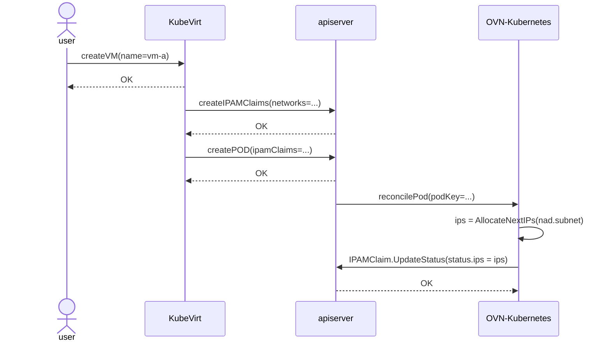
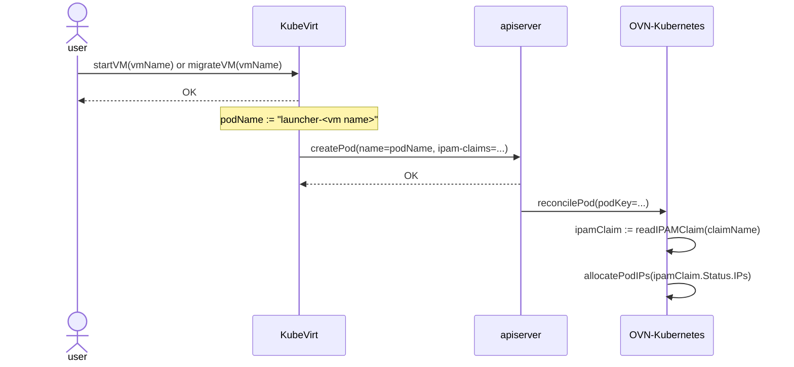

# Multihoming
A K8s pod with more than one network interface is said to be multi-homed. The
[Network Plumbing Working Group](https://github.com/k8snetworkplumbingwg/multi-net-spec)
has put forward a [standard](https://github.com/k8snetworkplumbingwg/multi-net-spec)
describing how to specify the configurations for additional network interfaces.

There are several delegating plugins or meta-plugins (Multus, Genie)
implementing this standard.

After a pod is scheduled on a particular Kubernetes node, kubelet will invoke
the delegating plugin to prepare the pod for networking. This meta-plugin will
then invoke the CNI responsible for setting up the pod's default cluster
network, and afterwards it iterates the list of additional attachments on the
pod, invoking the corresponding delegate CNI implementing the logic to attach
the pod to that particular network.

## Configuring secondary networks
To allow pods to have multiple network interfaces, the user must provide the
configurations specifying how to connect to these networks; these
configurations are defined in a CRD named `NetworkAttachmentDefinition`.

Below you will find example attachment configurations for each of the current
topologies OVN-K allows for secondary networks.

**NOTE**:
- networks are **not** namespaced - i.e. creating multiple
  `network-attachment-definition`s with different configurations pointing at the
  same network (same `NetConf.Name` attribute) is **not** supported.

### Routed - layer 3 - topology
This topology is a simplification of the topology for the cluster default
network - but without egress.

There is a logical switch per node - each with a different subnet - and a
router interconnecting all the logical switches.

The following net-attach-def configures the attachment to a routed secondary
network.

```yaml
apiVersion: k8s.cni.cncf.io/v1
kind: NetworkAttachmentDefinition
metadata:
  name: l3-network
  namespace: ns1
spec:
  config: |2
    {
            "cniVersion": "1.0.0",
            "name": "l3-network",
            "type": "ovn-k8s-cni-overlay",
            "topology":"layer3",
            "subnets": "10.128.0.0/16/24",
            "mtu": 1300,
            "netAttachDefName": "ns1/l3-network"
    }
```

#### Network Configuration reference
- `name` (string, required): the name of the network. This attribute is **not** namespaced.
- `type` (string, required): "ovn-k8s-cni-overlay".
- `topology` (string, required): "layer3".
- `subnets` (string, required): a comma separated list of subnets. When multiple subnets
  are provided, the user will get an IP from each subnet.
- `mtu` (integer, optional): explicitly set MTU to the specified value. Defaults to the value chosen by the kernel.
- `netAttachDefName` (string, required): must match `<namespace>/<net-attach-def name>`
  of the surrounding object.

**NOTE**
- the `subnets` attribute indicates both the subnet across the cluster, and per node.
  The example above means you have a /16 subnet for the network, but each **node** has
  a /24 subnet.
- routed - layer3 - topology networks **only** allow for east/west traffic.

### Switched - layer 2 - topology
This topology interconnects the workloads via a cluster-wide logical switch.

The following net-attach-def configures the attachment to a layer 2 secondary
network.

```yaml
apiVersion: k8s.cni.cncf.io/v1
kind: NetworkAttachmentDefinition
metadata:
  name: l2-network
  namespace: ns1
spec:
  config: |2
    {
            "cniVersion": "1.0.0",
            "name": "l2-network",
            "type": "ovn-k8s-cni-overlay",
            "topology":"layer2",
            "subnets": "10.100.200.0/24",
            "mtu": 1300,
            "netAttachDefName": "ns1/l2-network",
            "excludeSubnets": "10.100.200.0/29"
    }
```

#### Network Configuration reference
- `name` (string, required): the name of the network. This attribute is **not** namespaced.
- `type` (string, required): "ovn-k8s-cni-overlay".
- `topology` (string, required): "layer2".
- `subnets` (string, optional): a comma separated list of subnets. When multiple subnets
  are provided, the user will get an IP from each subnet.
- `mtu` (integer, optional): explicitly set MTU to the specified value. Defaults to the value chosen by the kernel.
- `netAttachDefName` (string, required): must match `<namespace>/<net-attach-def name>`
  of the surrounding object.
- `excludeSubnets` (string, optional): a comma separated list of CIDRs / IPs.
  These IPs will be removed from the assignable IP pool, and never handed over
  to the pods.
- `allowPersistentIPs` (boolean, optional): persist the OVN Kubernetes assigned
   IP addresses in a `ipamclaims.k8s.cni.cncf.io` object. This IP addresses will
   be reused by other pods if requested. Useful for KubeVirt VMs. Only makes
   sense if the `subnets` attribute is also defined.

**NOTE**
- when the subnets attribute is omitted, the logical switch implementing the
  network will only provide layer 2 communication, and the users must configure
  IPs for the pods. Port security will only prevent MAC spoofing.
- switched - layer2 - secondary networks **only** allow for east/west traffic.

### Switched - localnet - topology
This topology interconnects the workloads via a cluster-wide logical switch to
a physical network.

The following net-attach-def configures the attachment to a localnet secondary
network.

```yaml
apiVersion: k8s.cni.cncf.io/v1
kind: NetworkAttachmentDefinition
metadata:
  name: localnet-network
  namespace: ns1
spec:
  config: |2
    {
            "cniVersion": "1.0.0",
            "name": "localnet-network",
            "type": "ovn-k8s-cni-overlay",
            "topology":"localnet",
            "subnets": "202.10.130.112/28",
            "vlanID": 33,
            "mtu": 1500,
            "netAttachDefName": "ns1/localnet-network"
    }
```

Note that in order to connect to the physical network, it is expected that
ovn-bridge-mappings is configured appropriately on the chassis for this
localnet network.

#### Network Configuration reference
- `name` (string, required): the name of the network.
- `type` (string, required): "ovn-k8s-cni-overlay".
- `topology` (string, required): "localnet".
- `subnets` (string, optional): a comma separated list of subnets. When multiple subnets
  are provided, the user will get an IP from each subnet.
- `mtu` (integer, optional): explicitly set MTU to the specified value. Defaults to the value chosen by the kernel.
- `netAttachDefName` (string, required): must match `<namespace>/<net-attach-def name>`
  of the surrounding object.
- `excludeSubnets` (string, optional): a comma separated list of CIDRs / IPs.
  These IPs will be removed from the assignable IP pool, and never handed over
  to the pods.
- `vlanID` (integer, optional): assign VLAN tag. Defaults to none.
- `allowPersistentIPs` (boolean, optional): persist the OVN Kubernetes assigned
   IP addresses in a `ipamclaims.k8s.cni.cncf.io` object. This IP addresses will
   be reused by other pods if requested. Useful for KubeVirt VMs. Only makes
   sense if the `subnets` attribute is also defined.
- `physicalNetworkName` (string, optional): the name of the physical network to
  which the OVN overlay will connect. When omitted, it will default to the value
  of the localnet network `name`.

**NOTE**
- when the subnets attribute is omitted, the logical switch implementing the
  network will only provide layer 2 communication, and the users must configure
  IPs for the pods. Port security will only prevent MAC spoofing.

#### Sharing the same physical network mapping
To prevent the admin from having to reconfigure the cluster nodes whenever they
want to - let's say - add a VLAN, OVN-Kubernetes allows multiple network
overlays to re-use the same physical network mapping.

To do this, the cluster admin would provision two different networks (with
different VLAN tags) using the **same** physical network name. Please check the
example below for an example of this configuration:
```yaml
---
apiVersion: k8s.cni.cncf.io/v1
kind: NetworkAttachmentDefinition
metadata:
  name: bluenet
  namespace: test
spec:
  config: |
    {
            "cniVersion": "0.3.1",
            "name": "tenantblue",
            "type": "ovn-k8s-cni-overlay",
            "topology": "localnet",
            "netAttachDefName": "test/bluenet",
            "vlanID": 4000,
            "physicalNetworkName": "physnet"
    }
---
apiVersion: k8s.cni.cncf.io/v1
kind: NetworkAttachmentDefinition
metadata:
  name: isolatednet
  namespace: test
spec:
  config: |
    {
            "cniVersion": "0.3.1",
            "name": "sales",
            "type": "ovn-k8s-cni-overlay",
            "topology": "localnet",
            "netAttachDefName": "test/isolatednet",
            "vlanID": 1234,
            "physicalNetworkName": "physnet"
    }
```

> [!WARNING]
> Keep in mind OVN-Kubernetes does **not** validate the physical network
> configurations in any way: the admin must ensure these configurations are
> holistically healthy - e.g. the defined subnets do not overlap, the MTUs make
> sense, etc.

## Pod configuration
The user must specify the secondary network attachments via the
`k8s.v1.cni.cncf.io/networks` annotation.

The following example provisions a pod with two secondary attachments, one for
each of the attachment configurations presented in
[Configuring secondary networks](#configuring-secondary-networks).

```yaml
apiVersion: v1
kind: Pod
metadata:
  annotations:
    k8s.v1.cni.cncf.io/networks: l3-network,l2-network
  name: tinypod
  namespace: ns1
spec:
  containers:
  - args:
    - pause
    image: registry.k8s.io/e2e-test-images/agnhost:2.36
    imagePullPolicy: IfNotPresent
    name: agnhost-container
```

### Setting static IP addresses on a pod
The user can specify attachment parameters via
[network-selection-elements](https://github.com/k8snetworkplumbingwg/network-attachment-definition-client/blob/63033d5c63d1cf56f924a5454c8f2ac444b6736d/pkg/apis/k8s.cni.cncf.io/v1/types.go#L137)
, namely IP, MAC, and interface name.

Refer to the following yaml for an example on how to request a static IP for a
pod, a MAC address, and specify the pod interface name.

```yaml
apiVersion: v1
kind: Pod
metadata:
  annotations:
    k8s.v1.cni.cncf.io/networks: '[
      {
        "name": "l2-network",
        "mac": "02:03:04:05:06:07",
        "interface": "myiface1",
        "ips": [
          "192.0.2.20/24"
        ]
      }
    ]'
  name: tinypod
  namespace: ns1
spec:
  containers:
  - args:
    - pause
    image: registry.k8s.io/e2e-test-images/agnhost:2.36
    imagePullPolicy: IfNotPresent
    name: agnhost-container
```

**NOTE:**
- the user can specify the IP address for a pod's secondary attachment
  **only** for an L2 or localnet attachment.
- specifying a static IP address for the pod is only possible when the
  attachment configuration does **not** feature subnets.

## Persistent IP addresses for virtualization workloads
OVN-Kubernetes provides persistent IP addresses for virtualization workloads,
allowing VMs to have the same IP addresses when they migrate, when they restart,
and when they stop, the resume operation.

For that, the network admin must configure the network accordingly - the
`allowPersistentIPs` flag must be enabled in the NAD of the network. As with the
other network knobs, all NADs pointing to the same network **must** feature the
same configuration - i.e. all NADs in the network must either allow (or reject)
persistent IPs.

The client application (which creates the VM, and manages its lifecycle) is
responsible for creating the `ipamclaims.k8s.cni.cncf.io` object, and point to
it in the network selection element upon pod creation; OVN-Kubernetes will then
persist the IP addresses it has allocated the pod in the `IPAMClaim`. This flow
is portrayed in the sequence diagram below.



Whenever a VM is migrated, restarted, or stopped / then started a new pod will
be scheduled to host the VM; it will also point to the same `IPAMClaim`s, and
OVN-Kubernetes will fulfill the IP addresses being requested by the client.
This flow is shown in the sequence diagram below.



Managing the life-cycle of the `IPAMClaim`s objects is the responsibility of the
client application that created them in the first place. In this case, KubeVirt.

This feature is described in detail in the following KubeVirt
[design proposal](https://github.com/kubevirt/community/pull/279).

## IPv4 and IPv6 dynamic configuration for virtualization workloads on L2 primary UDN
For virtualization workloads using a primary UDN with layer2 topology ovn-k 
configure some DHCP and NDP flows to server ipv4 and ipv6 configuration for them.

For both ipv4 and ipv6 the following parameters are configured using DHCP or RAs:
- address
- gateway
- dns (read notes below)
- hostname (vm's name)
- mtu (taken from network attachment definition)

### Configuring dns server
By default the DHCP server at ovn-kuberntes will configure the kubernetes
default dns service `kube-system/kube-dns` as the name server. This can be
overridden with the following command line options:
- dns-service-namespace
- dns-service-name

## Limitations
OVN-K currently does **not** support:
- the same attachment configured multiple times in the same pod - i.e.
  `k8s.v1.cni.cncf.io/networks: l3-network,l3-network` is invalid.
- updates to the network selection elements lists - i.e. `k8s.v1.cni.cncf.io/networks` annotation
- IPv6 link local addresses not derived from the MAC address as described in RFC 2373, like  Privacy Extensions defined by RFC 4941, 
  or the Opaque Identifier generation methods defined in RFC 7217.
