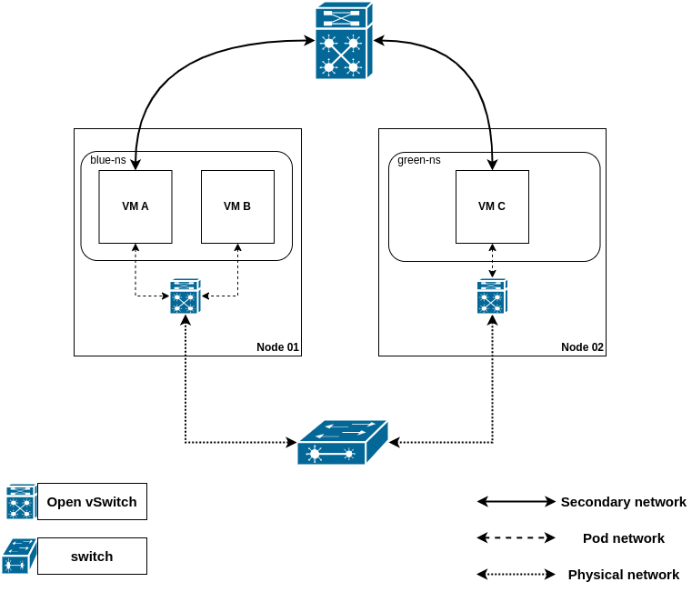
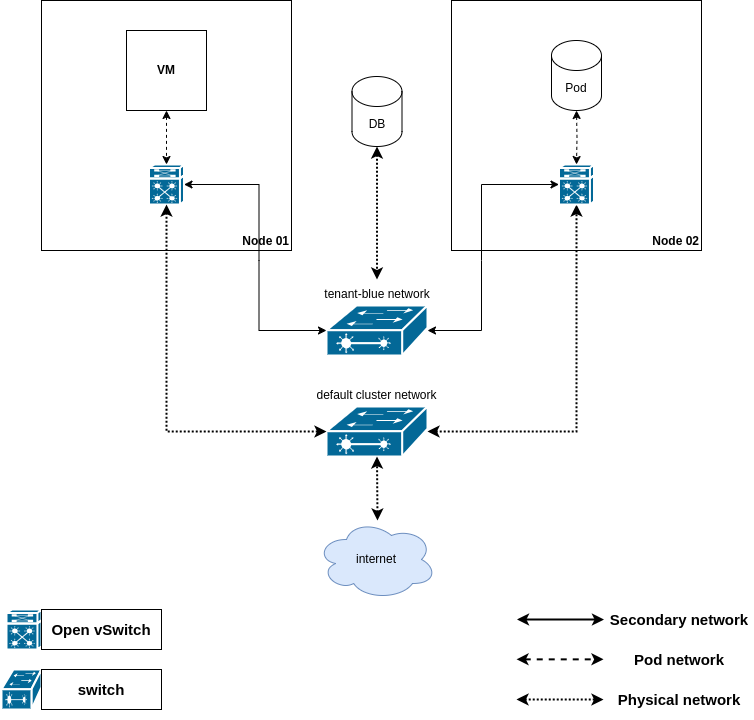

# MultiNetworkPolicies
## Introduction
[multi-networkpolicy](https://github.com/k8snetworkplumbingwg/multi-networkpolicy) provides
[network policy](https://kubernetes.io/docs/concepts/services-networking/network-policies/)
features for secondary networks, and allows enhanced traffic security.

## Motivation
In Kubernetes the paradigm is that by default, all pods can reach other pods, and security is provided by
implementing [Network Policy](https://kubernetes.io/docs/concepts/services-networking/network-policies/).
MultiNetworkPolicies provide the same security solution to secondary interfaces.
For users seeking network security using multi-homing - traffic restrictions based on user network configuration is a
recommended practice.

For example, by defining policies that specify which services a workload can access, they mitigate supply chain attacks
and reduce the risk of lateral movement.
Even if a component is compromised, it won’t be able to jeopardize other components of the system.

## User-Stories
As a project administrator, I want to enforce network policies that must be adhered to by all workloads on
my namespace. This will secure my namespace’s network traffic.

## User-case
- Limit access between workloads running on the cluster connected on a flat layer2 topology:
  In this case example, VMA is a data processor, VMC is a real-time data producer, and VMB is a monitoring and alerting unit.
  The data producer (VMC) can send data to the data processor (VMA), but cannot communicate with the monitoring unit (VMB).
  The data processor (VMA) can send alerts and metrics to the monitoring unit (VMB).
  
  
- Limit access to a database set outside the cluster, connected to VM and Pod workloads via localnet overlay network:
  In this case example, only the VM has access to the database.
  
  

## How to enable this feature on an OVN-Kubernetes cluster?
The `multi-network-policies` feature must be enabled in the OVN-Kubernetes configuration.
Please use the `Feature Config` option `enable-multi-network` under `OVNKubernetesFeatureConfig` config to enable it.

## Workflow Description
To configure pod isolation, the user must:
- provision a `network-attachment-definition`.
- provision a `MultiNetworkPolicy` indicating to which secondary networks it
  applies via the
  [policy-for](https://github.com/k8snetworkplumbingwg/multi-networkpolicy#policy-for-annotation)
  annotation.

Please refer to the following example:

```yaml
---
apiVersion: k8s.cni.cncf.io/v1
kind: NetworkAttachmentDefinition
metadata:
  name: tenant-blue
spec:
    config: '{
        "cniVersion": "0.4.0",
        "name": "tenant-blue-net",
        "netAttachDefName": "default/tenant-blue",
        "topology": "layer2",
        "type": "ovn-k8s-cni-overlay",
        "subnets": "192.168.100.0/24"
    }'
---
apiVersion: k8s.cni.cncf.io/v1beta1
kind: MultiNetworkPolicy
metadata:
  annotations:
    k8s.v1.cni.cncf.io/policy-for: default/tenant-blue # indicates the net-attach-defs this policy applies to
  name: allow-ports-same-ns
spec:
  podSelector:
    matchLabels:
      app: stuff-doer # the policy will **apply** to all pods with this label
  ingress:
  - ports:
    - port: 9000
      protocol: TCP
    from:
    - namespaceSelector:
        matchLabels:
          role: trusted # only pods on namespaces with this label will be allowed on port 9000
  policyTypes:
    - Ingress
```

Please note the `MultiNetworkPolicy` has the **exact same** API of the native
`networking.k8s.io/v1` `NetworkPolicy`object; check its documentation for more
information.

> [!NOTE]
> `net-attach-def`s referred to by the `k8s.v1.cni.cncf.io/policy-for`
annotation without the subnet attribute defined are possible if the policy
**only features** `ipBlock` peers. If the `net-attach-def` features the
`subnet` attribute, it can also feature `namespaceSelectors` and `podSelectors`.

## User facing API Changes
There are no user facing API Changes.
