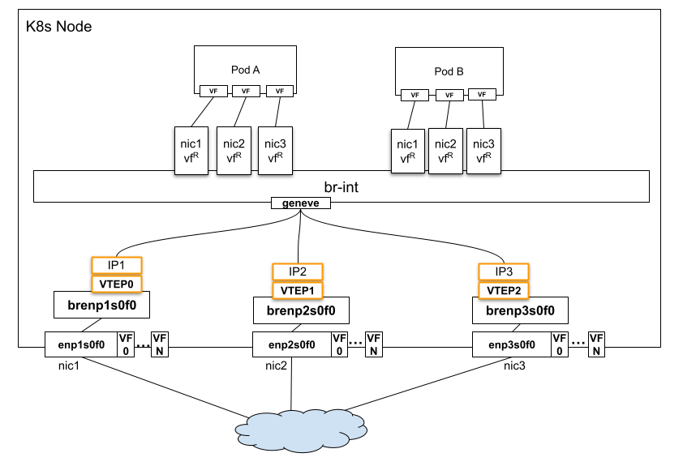

# Multi-VTEP

## Introduction

When a K8s cluster has multiple networks and K8s nodes have multiple SR-IOV
network adapters to provide different overlaying virtual networks over the
physical networks, multiple VTEP(Virtual Tunnel EndPoint) devices are
required for encapsulating and de-encapsulating the network traffic from/to
virtual networks. The challenge is in deciding which VTEP to use to
send/receive the packets to/from the wire. This feature instructs OVN to use
the appropriate VTEP IP as the source or destination IP for east-west traffic.

## Motivation

For applications with network traffic that can be categorized by purpose and
are sensitive to network latency, it is advantageous to use multiple NICs
designated for different purposes. This enhances the performance, security,
and flexibility of the network. Additionally, with network adapters that
support SR-IOV, traffic can be offloaded to hardware, further reducing
network latency and decreasing host CPU usage.


### User-Stories/Use-Cases

Consider a cloud environment providing online video streaming,
where each node is equipped with three NICs. One NIC could be dedicated to
management traffic, another to video streaming traffic, and the third to
storage. In this setup, each NIC would have its own VTEP IP. This
configuration ensures that overlay traffic from a Pod’s VF is steered through
the specific NIC associated with that VF. For example, streaming traffic must
be routed exclusively through the second NIC, optimizing network performance
and traffic segregation.



* vf<sup>R</sup> is VF representor.

## How to enable this feature on an OVN Kubernetes cluster?

On OVN Kubernetes side, no additional configuration required to enable this feature.

This feature depends on a specific underlay network setup; it cannot be turned on
without an adequate underlay network configuration.

## Implementation Details

This feature requires an OVN version newer than v24.03.2.

When the source and destination are overlay IPs, the packets need to be
encapsulated and sent through a tunnel. When there are multiple NICs
used for tunneling traffic, each with a different VTEP IP, OVN needs
to select the right tunnel endpoint to send the traffic, based on the
below criteria:

* The tunnel/NIC selection should be based on the source & destination
  interface of the traffic, which should be aligned with the VF selection
  specified by ovn-kubernetes.
* The source tunnel IP should be selected according to the source
  interface of the packet.
* The destination tunnel IP should be selected according to the destination
  interface of the packet.
* If an interface is not assigned a VTEP, traffic to/from the interface can
  choose any VTEP of the host.
* For BUM(broadcast, unknown-unicast, and multicast traffic) traffic, it
  is ok to select any VTEP.

#### OVN Constructs created in the databases

OVN Sourthbound Database:
* Port_Binding:encap - Populated by ovn-controller according to VIF
  interface’s external_ids:ovn-encap-ip.
* Encap:IP - The IP in the corresponding Encap record will be used
  as the VTEP IP.

OVS Database on chassis:
* Each Chassis may have multiple Encaps, determined by
  `open_vswitch:external_ids:ovn-encap-ip` which is a comma separated
  string of IPs.
* Each VIF interface (if needs to be assigned to a particular VTEP)
  will have `external_ids:ovn-encap-ip`, which must be one of the IPs
  configured in open_vswitch:external_ids:ovn-encap-ip of the chassis.
* A option `open_vswitch:external_ids:ovn-pf-encap-ip-mapping` is
  added to define the mapping between PF interface name and its VTEP IP.


### OVN Kubernetes Implementation Details

To support this feature, the VTEP interfaces must be configured in advance.
This can be accomplished using a system network management tool, such as
Network Manager.

Assuming a node has 3 NICs and VTEP interfaces:
| PF       | VTEP  | VTEP IP      |
| :------- | :---- | :----------- |
| enp1s0f0 | vtep0 | 10.0.0.1/23 |
| enp2s0f0 | vtep1 | 10.0.0.2/23 |
| enp3s0f0 | vtep2 | 10.0.0.3/23 |


The VTEP interfaces on OVS bridges should be configured as below:
```
$ ovs-vsctl  show
e620a080-c761-44d0-adb3-203bb1df6d67
    Bridge brenp1s0f1
        ...
        Port vtep0
            tag: 25 # just an example VLAN-ID
            Interface vtep0
                type: internal
    Bridge brenp2s0f0
        ...
        Port vtep1
            tag: 25
            Interface vtep1
                type: internal
    Bridge brenp3s0f0
        ...
        Port vtep2
            tag: 25
            Interface vtep2
                type: internal
```

Below Open_vSwitch external_ids need to be configured in osvsdb:
- `external_ids:ovn-encap-ip`: set it to a list of vtep IPs, separated by
  commas, in any order.
- `external_ids:ovn-pf-encap-ip-mapping`: set it to list of vtep-interface
  to IP pairs separated by comma.

For example:
```
$ ovs-vsctl --timeout=15 --if-exists get Open_vSwitch . external_ids:ovn-encap-ip
"10.0.0.1,10.0.0.2,10.0.0.3"

$ ovs-vsctl --timeout=15 --if-exists get Open_vSwitch . external_ids:ovn-pf-encap-ip-mapping
"enp1s0f0:10.0.0.1,enp2s0f0:10.0.0.2,enp3s0f0:10.0.0.3"
```
With above `external_ids:ovn-encap-ip` settings, OVN creates 3 tunnel ports for
each encap-ip on remote node, that's, if remote node has 2 encap-ips in
`external_ids:ovn-encap-ip`, 6 tunnel ports will be created on the local node.
For example, if remote node only has one encap-ip "10.0.0.10", OVN creates
below tunnel ports on the local node:
```
$ ovs-vsctl  show
    Bridge br-int
        Port ovn0-5e3e5-0
            Interface ovn0-5e3e5-0
                type: geneve
                options: {csum="true", key=flow, local_ip="10.0.0.1", remote_ip="10.0.0.10", tos=inherit}
        Port ovn0-e815c-1
            Interface ovn0-e815c-1
                type: geneve
                options: {csum="true", key=flow, local_ip="10.0.0.2", remote_ip="10.0.0.10", tos=inherit}
        Port ovn-33f2e5-0
            Interface ovn-33f2e5-0
                type: geneve
                options: {csum="true", key=flow, local_ip="10.0.0.3", remote_ip="10.0.0.10", tos=inherit}
```


Ovn-controller programs physical flows that create mappings between
<in_port, out_port> and <tunnel port> according to the aforementioned data
model. The <in_port> information needs to be carried through a global register.
**The bits 16-31 of the reg13 can be used for this purpose**. The reg13 is
currently used to store conntrack zones for each VIF. However, it doesn’t
really require 32 bits, and the first 16 bits (0-15) are sufficient. Its
current usage with assignment of all 32 bits in certain pipelines need
to be updated.

When ovnkube-node adding a Pod's network interfaces to OVS br-int during the Pod
creation, it identifies the corresponding PF interface for each VF interface, it
then looks up `external_ids:ovn-pf-encap-ip-mapping` to determine the encap IP,
which is subsequently assigned to the OVS Port's `external_ids:ovn-encap-ip`.
This encap IP will be utilized as the source IP in the tunnel header.

To steer outgoing traffic through the correct physical interface,
the following source-based routing rules are required on K8s node:

```
$ ip rule list
...
6081:   from 10.0.0.1 lookup 6081 proto static
6082:   from 10.0.0.2 lookup 6082 proto static
6083:   from 10.0.0.3 lookup 6083 proto static

$ ip route list table 6081
10.0.0.0/23 dev vtep0 scope link
10.0.0.0/16 via 10.0.0.1 dev vtep0 proto static metric 804
$ ip route list table 6082
10.0.0.0/23 dev vtep1 scope link
10.0.0.0/16 via 10.0.0.1 dev vtep1 proto static metric 802
$ ip route list table 6083
10.0.0.0/23 dev vtep2 scope link
10.0.0.0/16 via 10.0.0.1 dev vtep2 proto static metric 806
```

## Known Limitations

This feature only works with network adapters that support SR-IOV,
e.g. NVIDIA CONNECTX-6 or NVIDIA BlueField-2 in NIC mode.
