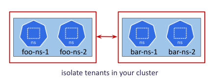
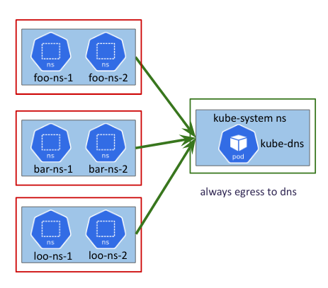
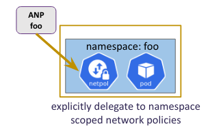
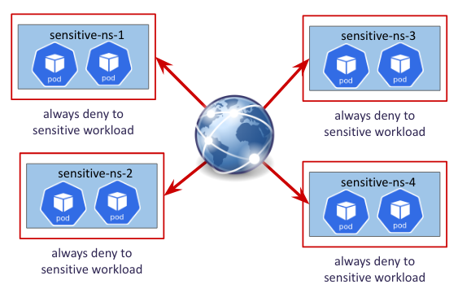
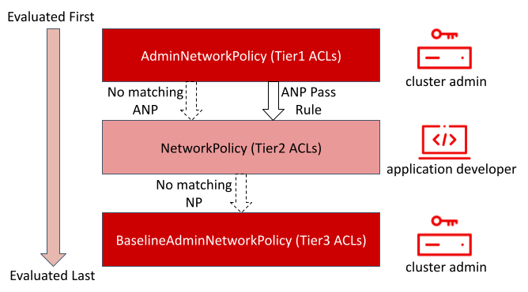
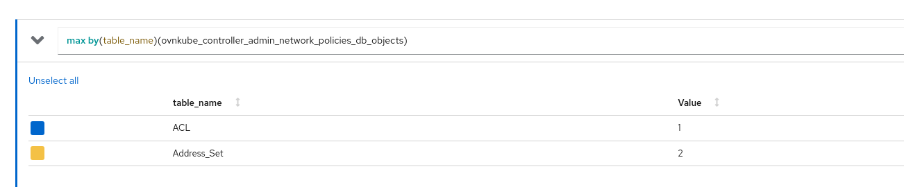
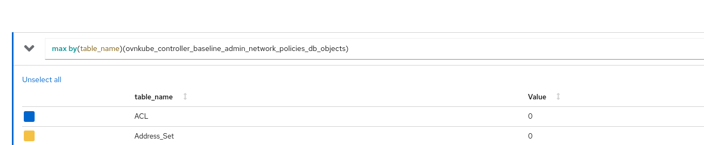
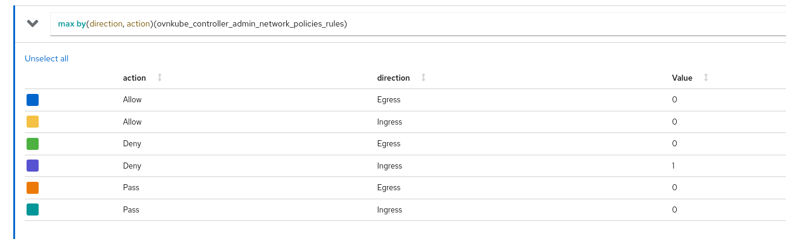
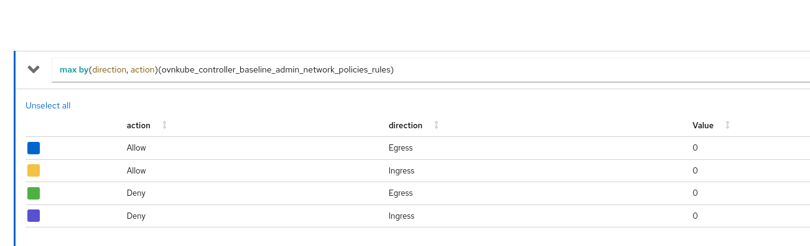

# AdminNetworkPolicy

## Introduction

Being able to enforce airtight application security at the cluster-wide level
has been a popular ask from cluster administrators. Key admin user stories include:

* As a cluster administrator, I want to enforce non-overridable admin network
  policies that have to be adhered to by all user tenants in the cluster, thus
  securing my cluster’s network traffic.
* As a cluster administrator, I want to implement specific network restrictions
  across multiple tenants (a tenant here refers to one or more namespaces),
  thus facilitating network multi-tenancy.
* As a cluster administrator, I want to enforce the tenant isolation model
  (a tenant cannot receive traffic from any other tenant) as the cluster’s default
  network security standard, thus delegating the responsibility of explicitly allowing
  traffic from other tenants to the tenant owner using NetworkPolicies.

AdminNetworkPolicy has been designed precisely to solve these problems. It provides
a comprehensive cluster-wide network security solution for cluster administrators using
two cluster-scoped CRDs:

* AdminNetworkPolicy API and
* BaselineAdminNetworkPolicy API

which are shipped by the [sig-network-policy-api](https://network-policy-api.sigs.k8s.io/)
working group as out-of-tree Kubernetes APIs. Both these APIs can be used to define
cluster-wide admin policies in order to secure your cluster’s network traffic. These APIs
are currently in the v1alpha1 version and subject to change based on upstream developments
before becoming stable v1.

## Motivation

[NetworkPolicies](https://kubernetes.io/docs/concepts/services-networking/network-policies/)
in Kubernetes were created for developers to be able to secure their applications. Hence they
are under the control of potentially untrusted application authors. They are namespace scoped
and are not suitable for solving the above user stories for cluster administrators because:

* They are not cluster-scoped and hence its hard to define a network of policies
  that spans across namespaces - you'd have to duplicate the same policy over and over
  in each namespace
* They cannot be created before the namespace is created (KAPI server expects the namespace
  to be created first since it's namespace scoped); thus they cannot satisfy the requirements
  where admins may want the policies to be applicable to arbitrary future
  namespaces that could get created in the cluster.

Another motivation was to fix some of the usability aspects of the NetworkPolicy API.
NetworkPolicy API is designed with an implicit deny-all policy, meaning that with the
first created policy all traffic not allowed by it will be denied. NetworkPolicy only
defines which connection will be allowed. Then we make other exceptions like `except`
blocks in `ipBlock` construct which is an explicit what not to allow within the allowList.
Network administrators prefer to have the power of defining what exactly to deny and
allow instead of this implicit model.

### User-Stories/Use-Cases

Check out the original [User Stories](https://network-policy-api.sigs.k8s.io/user-stories/)
for AdminNetworkPolicy. Follow the new developments for this API via the
[Network Policy Enhancement Proposals](https://network-policy-api.sigs.k8s.io/enhancements/).
Let us look at some practical use cases of when to use admin network policies
in your cluster:

* Isolate tenants



* Always allow egress traffic from all workloads to DNS namespace or splunk namespace



* Always allow ingress traffic from monitoring namespace to all workloads


* Delegate to namespace scoped network policies (we will learn more about what this is
  in the following sections)



* Always deny traffic to sensitive namespaces from everywhere



## How to enable this feature on an OVN-Kubernetes cluster?

This feature is enabled by default on all OVN-Kubernetes clusters.
You don't need to do anything extra to start using this feature.
There is a Feature Config option `enable-admin-network-policy` under
`OVNKubernetesFeatureConfig` config that can be used to disable this
feature. However note that disabling the feature will not remove
existing CRs in the cluster.

When the feature is enabled, the CRDs are installed on the cluster
and the `AdminNetworkPolicy` controller is invoked.

```shell
$ oc get crd adminnetworkpolicies.policy.networking.k8s.io
NAME                                            CREATED AT
adminnetworkpolicies.policy.networking.k8s.io   2023-10-01T11:33:58Z
$ oc get crd baselineadminnetworkpolicies.policy.networking.k8s.io
NAME                                                    CREATED AT
baselineadminnetworkpolicies.policy.networking.k8s.io   2023-10-01T11:33:58Z
```

## Workflow Description

## Implementation Details

### User facing API Changes

Like mentioned above, the API lives in the
[kubernetes-sigs](https://github.com/kubernetes-sigs/network-policy-api) repo.

#### AdminNetworkPolicy Sample API

Let us look at a sample ANP yaml:

```yaml
apiVersion: policy.networking.k8s.io/v1alpha1
kind: AdminNetworkPolicy
metadata:
  name: cluster-control
spec:
  priority: 34
  subject:
    namespaces: {}
  ingress:
  - name: "allow-from-ingress-nginx" # rule0
    action: "Allow"
    from:
    - namespaces:
        matchLabels:
          kubernetes.io/metadata.name: ingress-nginx
  - name: "allow-from-monitoring" # rule1
    action: "Allow"
    from:
    - namespaces:
        matchLabels:
          kubernetes.io/metadata.name: monitoring
    ports:
    - portNumber:
        protocol: TCP
        port: 7564
    - namedPort: "scrape"
  - name: "allow-from-open-tenants" # rule2
    action: "Allow"
    from:
    - namespaces: # open tenants
        matchLabels:
          tenant: open
  - name: "pass-from-restricted-tenants" # rule3
    action: "Pass"
    from:
    - namespaces: # restricted tenants
        matchLabels:
          tenant: restricted
  - name: "default-deny" # rule4
    action: "Deny"
    from:
    - namespaces: {}
  egress:
  - name: "allow-to-dns" # rule0
    action: "Allow"
    to:
    - pods:
        namespaceSelector:
          matchLabels:
            kubernetes.io/metadata.name: kube-system
        podSelector:
          matchLabels:
            app: dns
    ports:
    - portNumber:
        protocol: UDP
        port: 5353
  - name: "allow-to-kapi-server" # rule1
    action: "Allow"
    to:
    - nodes:
        matchExpressions:
        - key: node-role.kubernetes.io/control-plane
          operator: Exists
    ports:
    - portNumber:
        protocol: TCP
        port: 6443
  - name: "allow-to-splunk" # rule2
    action: "Allow"
    to:
    - namespaces:
        matchLabels:
          tenant: splunk
    ports:
    - portNumber:
        protocol: TCP
        port: 8991
    - portNumber:
        protocol: TCP
        port: 8992
  - name: "allow-to-open-tenants-and-intranet-and-worker-nodes" # rule3
    action: "Allow"
    to:
    - nodes: # worker-nodes
        matchExpressions:
        - key: node-role.kubernetes.io/worker
          operator: Exists
    - networks: # intranet
      - 172.30.0.0/30
      - 10.0.54.0/19
      - 10.0.56.38/32
      - 10.0.69.0/24
    - namespaces: # open tenants
        matchLabels:
          tenant: open
  - name: "pass-to-restricted-tenants" # rule4
    action: "Pass"
    to:
    - namespaces: # restricted tenants
        matchLabels:
          tenant: restricted
  - name: "default-deny"
    action: "Deny"
    to:
    - networks:
      - 0.0.0.0/0
```

* `subject` is the set of pods selected by `cluster-control` ANP, on
  which the rules in the policy are applied on. Here its all the pods
  in the cluster.
* Each AdminNetworkPolicy resource will have a`.spec.priority` field. `priority`
  is 34 here that determines the priority of this ANP versus other
  ANPs in your cluster.  The lower the number the higher the precedence.
  Thus 0 is the highest priority and 99 (the largest number supported
  by OVN-Kubernetes) is the lowest priority.
* `ingress` has 5 rules:
    * rule0: always allow ingress traffic coming from ingress-nginx namespace
      to all the pods in the cluster
    * rule1: always allow TCP ingress traffic coming from port 7564 of
      pods in monitoring namespace
    * rule2: always allow all ingress traffic from `open` tenant's namespaces
    * rule3: always pass all ingress traffic from `restricted` tenant's namespaces
      (please check the following sections to learn more about what `pass` is)
    * rule4: deny all other ingress traffic including same namespace pods
* `egress` has 6 rules:
    * rule0: always allow egress traffic coming from all pods to dns pods
    * rule1: always allow TCP egress traffic coming from all pods to KAPI pods
    * rule2: always allow all egress traffic coming from all pods to splunk logging
      tenant at TCP ports 8991 and 8992
    * rule3: always allow all egress traffic to `open` tenant's namespaces, company's
      intranet CIDR ranges and all worker nodes in the cluster
    * rule4: always pass all egress traffic to `restricted` tenant's namespaces
      (please check the following sections to learn more about what `pass` is)
    * rule5: deny all other egress traffic including same namespace pods

You can do `oc apply -f cluster-control.yaml` to create this ANP in your cluster
```shell
$ oc get anp
NAME              PRIORITY   AGE
cluster-control   34         3s
```

#### BaselineAdminNetworkPolicy Sample API

Unlike ANP's BANP is a singleton object in your
cluster. BANP specifies baseline policies that apply
unless they are overridden by a NetworkPolicy or ANP.

Let us look at a sample BANP yaml:

```yaml
apiVersion: policy.networking.k8s.io/v1alpha1
kind: BaselineAdminNetworkPolicy
metadata:
  name: default
spec:
  subject:
    namespaces: {}
  ingress:
  - name: "default-deny"
    action: "Deny"
    from:
    - namespaces: {}
  egress:
  - name: "default-deny"
    action: "Deny"
    to:
    - namespaces: {}
```

You can do `oc apply -f default.yaml` to create this ANP in your cluster
```shell
$ oc get banp
NAME      AGE
default   16m
```

Note that when you use `{}` selectors to select pods
you are selecting ALL the pods in the cluster including
`kube-system` and `ovn-kubernetes` namespaces which is
something you probably don't want to do. If you do this,
then the cluster will go into a non-functional state since
basic infrastructued pods cannot communicate unless you
explicitly define higher priority allow rules.

Almost always you probably need a policy that looks like:
```yaml
apiVersion: policy.networking.k8s.io/v1alpha1
kind: BaselineAdminNetworkPolicy
metadata:
  name: default
spec:
  subject:
    namespaces:
      matchLabels:
          type: all-workload-namespaces
  ingress:
  - name: "default-deny"
    action: "Deny"
    from:
    - namespaces:
        matchLabels:
          type: all-workload-namespaces
  egress:
  - name: "default-deny"
    action: "Deny"
    to:
    - namespaces:
        matchLabels:
          type: all-workload-namespaces
```

### OVN-Kubernetes Implementation Details

We have a new level driven controller in OVN-Kubernetes
called [admin_network_policy](https://github.com/ovn-org/ovn-kubernetes/tree/master/go-controller/pkg/ovn/controller/admin_network_policy)
which watches for the following objects:

* AdminNetworkPolicy
* BaselineAdminNetworkPolicy
* Namespaces
* Pods
* Nodes

in your cluster. For each add, update and delete event
that this controller cares about for each of the above
objects, it add's it to the centralized ANP and BANP
queue in a single threaded fashion.

The controller maintains an internal cache state for each
corresponding ANP and tries to level the current state
configuration for a given ANP with the desired state
configuration for that ANP.

It also emits events like `ANPWithUnsupportedPriority` and
`ANPWithDuplicatePriority` so that users are aware in those
circumstances.

#### Pass Action: Delegate decision to NetworkPolicies

In addition to setting `Deny` and `Allow` actions on ANP API rules,
one can also use the `Pass` action for a rule. What this means is
ANP controller defers the decision of connections that match the pass
action rule to either the NetworkPolicy OR to the BaselineAdminNetworkPolicy
defined in the cluster (if either of them match the same set of pods,
then they will take effect and if not, the result will be an `Allow`).
Order of precedence: `AdminNetworkPolicy (Tier1) > NetworkPolicy(Tier2) > BaselineAdminNetworkPolicy (Tier3)`.



Ingress rule3 and Egress rule4 are examples of `Pass` action. Such
rules are created when the administrator wants to delegate the decision
of whether that connection should be allowed or not to NetworkPolicies
defined by tenant owners.

If we now define a network policy in `restricted` tenant's namespace
that matches on same ingress peers as in the subject of our `cluster-control`
admin network policy, that network policy will take effect.
This is how administrators can delegate a decision making to the namespace
owners in a cluster.

#### Pass Action: Delegate decision to BaselineAdminNetworkPolicies

Since we can delegate decisions from administrators to namespace owners,
what if namespace owners don't have policies in place for the same set of
subjects? Admins in such cases might want to keep a default set of guardrails
in the cluster. Thus we allow one BANP to be created in the cluster with the
name `default`. BANP doesn't have any priority field, since we can have only
one in the cluster. Rest of the implementation details for ANP is applicable
to BANP as well.

#### OVN Constructs created in the databases

* Each AdminNetworkPolicy CRD can have upto 100 ingress rules and 100 egress rules,
  thus 200 rules in total. The ordering of each rule is important. If the rule is
  at the top of the list then it has the highest precedence and if the rule is
  at the bottom it has the lowest precedence. Each rule translates to `nbdb.ACL`.
  We will have:
    * one single `nbdb.ACL` if `len(rule.ports) == 0 && len(rule.namedPorts) == 0`
    * one `nbdb.ACL` per protocol if `len(rule.ports) > 0 and len(rule.namedPorts) == 0`
	  (so max 3 `nbdb.ACLs` (tcp,udp,sctp) per rule {`portNumber`, `portRange` type ports ONLY})
    * one `nbdb.ACL` per protocol if `len(rule.namedPorts) > 0 and len(rule.ports) == 0`
	  (so max 3 ACLs (tcp,udp,sctp) per rule {`namedPort` type ports ONLY})
    * one ACL per protocol if `len(rule.ports) > 0` and one ACL per protocol `if len(rule.namedPorts) > 0`
    (so max 6 ACLs (2tcp,2udp,2sctp) per rule {`portNumber`, `portRange`, `namedPorts` all are present})
* Since we can have upto 100 policies and each one can have upto 100 gress rules
  (100*100), we have blocked out the range: 30,000 - 20,000 priority range for
  the OVN `nbdb.ACL` table in the `Tier1` block for ANP's implementation.
* Since we can have only 1 BANP in the cluster, we keep `nbdb.ACL`'s priority range
  1750 - 1649 range reserved for BANP ACLs in the `Tier3` block for BANP's implementation.
* Each AdminNetworkPolicy CRD will have a subject on which the policy is 
  applied on - this is translated to one `nbdb.PortGroup` on which the `nbdb.ACLs`
  of each rule in the policy are attached on. So there is one `nbdb.PortGroup` per ANP created.
* Each gress rule can have upto 100 peers. Each rule will also create an `nbdb.AddressSet`
  which will contain the IPs of all the pods, nodes and networks that are selected
  by the peer selector across all the peers of that given rule.

For the ANP created above, let us look at how these OVN constructs would
look like using the following commands:

NOTE: All commands must be run inside the ovnkube-node pod for
interconnect mode and ovnkube-master pod for default mode since
that is where the NBDB container is running.

`nbdb.ACL`: These can be listed using `ovn-nbctl list acl`

The Ingress ACLs for the above AdminNetworkPolicy are:

```shell
_uuid               : f4523ce3-fb80-4d68-a50b-8aa6a795f895
action              : allow-related
direction           : to-lport
external_ids        : {direction=Ingress, gress-index="0", "k8s.ovn.org/id"="default-network-controller:AdminNetworkPolicy:cluster-control:Ingress:0:None", "k8s.ovn.org/name"=cluster-control, "k8s.ovn.org/owner-controller"=default-network-controller, "k8s.ovn.org/owner-type"=AdminNetworkPolicy, port-policy-protocol=None}
label               : 0
log                 : false
match               : "outport == @a14645450421485494999 && ((ip4.src == $a14545668191619617708))"
meter               : acl-logging
name                : "ANP:cluster-control:Ingress:0"
options             : {}
priority            : 26600
severity            : []
tier                : 1

_uuid               : 4117970c-c138-45b5-a6de-8e5e54efcb04
action              : allow-related
direction           : to-lport
external_ids        : {direction=Ingress, gress-index="1", "k8s.ovn.org/id"="default-network-controller:AdminNetworkPolicy:cluster-control:Ingress:1:tcp", "k8s.ovn.org/name"=cluster-control, "k8s.ovn.org/owner-controller"=default-network-controller, "k8s.ovn.org/owner-type"=AdminNetworkPolicy, port-policy-protocol=tcp}
label               : 0
log                 : false
match               : "outport == @a14645450421485494999 && ((ip4.src == $a6786643370959569281)) && tcp && tcp.dst==7564"
meter               : acl-logging
name                : "ANP:cluster-control:Ingress:1"
options             : {}
priority            : 26599
severity            : []
tier                : 1

_uuid               : 1b1b1409-b96a-4e6d-9776-00d88c0c7ac9
action              : allow-related
direction           : to-lport
external_ids        : {direction=Ingress, gress-index="1", "k8s.ovn.org/id"="default-network-controller:AdminNetworkPolicy:cluster-control:Ingress:1:tcp-namedPort", "k8s.ovn.org/name"=cluster-control, "k8s.ovn.org/owner-controller"=default-network-controller, "k8s.ovn.org/owner-type"=AdminNetworkPolicy, port-policy-protocol=tcp-namedPort}
label               : 0
log                 : false
match               : "((ip4.src == $a6786643370959569281)) && tcp && ((ip4.dst == 10.244.1.4 && tcp.dst == 8080) || (ip4.dst == 10.244.2.8 && tcp.dst == 8080) || (ip4.dst == 10.244.2.8 && tcp.dst == 8080))"
meter               : acl-logging
name                : "ANP:cluster-control:Ingress:1"
options             : {}
priority            : 26599
severity            : []
tier                : 1

_uuid               : 00400c05-7225-4d64-9428-8b2a04c6c3da
action              : allow-related
direction           : to-lport
external_ids        : {direction=Ingress, gress-index="2", "k8s.ovn.org/id"="default-network-controller:AdminNetworkPolicy:cluster-control:Ingress:2:None", "k8s.ovn.org/name"=cluster-control, "k8s.ovn.org/owner-controller"=default-network-controller, "k8s.ovn.org/owner-type"=AdminNetworkPolicy, port-policy-protocol=None}
label               : 0
log                 : false
match               : "outport == @a14645450421485494999 && ((ip4.src == $a13730899355151937870))"
meter               : acl-logging
name                : "ANP:cluster-control:Ingress:2"
options             : {}
priority            : 26598
severity            : []
tier                : 1

_uuid               : 7f5ea19b-d465-4de4-8369-bdf66fdcd7d9
action              : pass
direction           : to-lport
external_ids        : {direction=Ingress, gress-index="3", "k8s.ovn.org/id"="default-network-controller:AdminNetworkPolicy:cluster-control:Ingress:3:None", "k8s.ovn.org/name"=cluster-control, "k8s.ovn.org/owner-controller"=default-network-controller, "k8s.ovn.org/owner-type"=AdminNetworkPolicy, port-policy-protocol=None}
label               : 0
log                 : false
match               : "outport == @a14645450421485494999 && ((ip4.src == $a764182844364804195))"
meter               : acl-logging
name                : "ANP:cluster-control:Ingress:3"
options             : {}
priority            : 26597
severity            : []
tier                : 1

_uuid               : 3e82df77-ad40-4dce-bd96-5b9e7e0b3603
action              : drop
direction           : to-lport
external_ids        : {direction=Ingress, gress-index="4", "k8s.ovn.org/id"="default-network-controller:AdminNetworkPolicy:cluster-control:Ingress:4:None", "k8s.ovn.org/name"=cluster-control, "k8s.ovn.org/owner-controller"=default-network-controller, "k8s.ovn.org/owner-type"=AdminNetworkPolicy, port-policy-protocol=None}
label               : 0
log                 : false
match               : "outport == @a14645450421485494999 && ((ip4.src == $a13814616246365836720))"
meter               : acl-logging
name                : "ANP:cluster-control:Ingress:4"
options             : {}
priority            : 26596
severity            : []
tier                : 1
```

The Egress ACLs for the above AdminNetworkPolicy are:

```shell
_uuid               : fdb266b7-758a-4471-9cc1-84d00dc4f2ae
action              : allow-related
direction           : from-lport
external_ids        : {direction=Egress, gress-index="0", "k8s.ovn.org/id"="default-network-controller:AdminNetworkPolicy:cluster-control:Egress:0:udp", "k8s.ovn.org/name"=cluster-control, "k8s.ovn.org/owner-controller"=default-network-controller, "k8s.ovn.org/owner-type"=AdminNetworkPolicy, port-policy-protocol=udp}
label               : 0
log                 : false
match               : "inport == @a14645450421485494999 && ((ip4.dst == $a13517855690389298082)) && udp && udp.dst==5353"
meter               : acl-logging
name                : "ANP:cluster-control:Egress:0"
options             : {apply-after-lb="true"}
priority            : 26600
severity            : []
tier                : 1

_uuid               : 8f1b8170-c350-4e9d-8ff0-a3177f9749ca
action              : allow-related
direction           : from-lport
external_ids        : {direction=Egress, gress-index="1", "k8s.ovn.org/id"="default-network-controller:AdminNetworkPolicy:cluster-control:Egress:1:tcp", "k8s.ovn.org/name"=cluster-control, "k8s.ovn.org/owner-controller"=default-network-controller, "k8s.ovn.org/owner-type"=AdminNetworkPolicy, port-policy-protocol=tcp}
label               : 0
log                 : false
match               : "inport == @a14645450421485494999 && ((ip4.dst == $a10706246167277696183)) && tcp && tcp.dst==6443"
meter               : acl-logging
name                : "ANP:cluster-control:Egress:1"
options             : {apply-after-lb="true"}
priority            : 26599
severity            : []
tier                : 1

_uuid               : 04dbde8f-eaa8-4973-a158-ec56d0be672f
action              : allow-related
direction           : from-lport
external_ids        : {direction=Egress, gress-index="2", "k8s.ovn.org/id"="default-network-controller:AdminNetworkPolicy:cluster-control:Egress:2:tcp", "k8s.ovn.org/name"=cluster-control, "k8s.ovn.org/owner-controller"=default-network-controller, "k8s.ovn.org/owner-type"=AdminNetworkPolicy, port-policy-protocol=tcp}
label               : 0
log                 : false
match               : "inport == @a14645450421485494999 && ((ip4.dst == $a18396736153283155648)) && tcp && tcp.dst=={8991,8992}"
meter               : acl-logging
name                : "ANP:cluster-control:Egress:2"
options             : {apply-after-lb="true"}
priority            : 26598
severity            : []
tier                : 1

_uuid               : c37d0794-8444-440e-87d0-02ef95c6e248
action              : allow-related
direction           : from-lport
external_ids        : {direction=Egress, gress-index="3", "k8s.ovn.org/id"="default-network-controller:AdminNetworkPolicy:cluster-control:Egress:3:None", "k8s.ovn.org/name"=cluster-control, "k8s.ovn.org/owner-controller"=default-network-controller, "k8s.ovn.org/owner-type"=AdminNetworkPolicy, port-policy-protocol=None}
label               : 0
log                 : false
match               : "inport == @a14645450421485494999 && ((ip4.dst == $a10622494091691694581))"
meter               : acl-logging
name                : "ANP:cluster-control:Egress:3"
options             : {apply-after-lb="true"}
priority            : 26597
severity            : []
tier                : 1

_uuid               : 2f3292f0-9676-4d02-a553-230c3a2885b8
action              : pass
direction           : from-lport
external_ids        : {direction=Egress, gress-index="4", "k8s.ovn.org/id"="default-network-controller:AdminNetworkPolicy:cluster-control:Egress:4:None", "k8s.ovn.org/name"=cluster-control, "k8s.ovn.org/owner-controller"=default-network-controller, "k8s.ovn.org/owner-type"=AdminNetworkPolicy, port-policy-protocol=None}
label               : 0
log                 : false
match               : "inport == @a14645450421485494999 && ((ip4.dst == $a5972452606168369118))"
meter               : acl-logging
name                : "ANP:cluster-control:Egress:4"
options             : {apply-after-lb="true"}
priority            : 26596
severity            : []
tier                : 1

_uuid               : 924b81fd-65cc-494b-9c29-0c5287d69bb1
action              : drop
direction           : from-lport
external_ids        : {direction=Egress, gress-index="5", "k8s.ovn.org/id"="default-network-controller:AdminNetworkPolicy:cluster-control:Egress:5:None", "k8s.ovn.org/name"=cluster-control, "k8s.ovn.org/owner-controller"=default-network-controller, "k8s.ovn.org/owner-type"=AdminNetworkPolicy, port-policy-protocol=None}
label               : 0
log                 : false
match               : "inport == @a14645450421485494999 && ((ip4.dst == $a11452480169090787059))"
meter               : acl-logging
name                : "ANP:cluster-control:Egress:5"
options             : {apply-after-lb="true"}
priority            : 26595
severity            : []
tier                : 1
```

`nbdb.AdressSet`: These can be listed using `ovn-nbctl list address-set`

The Ingress Address-Sets for the above AdminNetworkPolicy are:

```shell
_uuid               : c51329b3-e1f6-48b7-b674-129819279bbe
addresses           : ["10.244.2.5"]
external_ids        : {direction=Ingress, gress-index="0", ip-family=v4, "k8s.ovn.org/id"="default-network-controller:AdminNetworkPolicy:cluster-control:Ingress:0:v4", "k8s.ovn.org/name"=cluster-control, "k8s.ovn.org/owner-controller"=default-network-controller, "k8s.ovn.org/owner-type"=AdminNetworkPolicy}
name                : a14545668191619617708

_uuid               : 7e9e5dcd-8576-443b-8f32-0b31dca64e06
addresses           : ["10.244.1.4", "10.244.2.8"]
external_ids        : {direction=Ingress, gress-index="1", ip-family=v4, "k8s.ovn.org/id"="default-network-controller:AdminNetworkPolicy:cluster-control:Ingress:1:v4", "k8s.ovn.org/name"=cluster-control, "k8s.ovn.org/owner-controller"=default-network-controller, "k8s.ovn.org/owner-type"=AdminNetworkPolicy}
name                : a6786643370959569281

_uuid               : 59c30748-af15-4a75-8f0c-a36eb134bbca
addresses           : []
external_ids        : {direction=Ingress, gress-index="2", ip-family=v4, "k8s.ovn.org/id"="default-network-controller:AdminNetworkPolicy:cluster-control:Ingress:2:v4", "k8s.ovn.org/name"=cluster-control, "k8s.ovn.org/owner-controller"=default-network-controller, "k8s.ovn.org/owner-type"=AdminNetworkPolicy}
name                : a13730899355151937870

_uuid               : 191ea649-5849-4147-b07b-3f252c59cddb
addresses           : ["10.244.1.3", "10.244.2.7"]
external_ids        : {direction=Ingress, gress-index="3", ip-family=v4, "k8s.ovn.org/id"="default-network-controller:AdminNetworkPolicy:cluster-control:Ingress:3:v4", "k8s.ovn.org/name"=cluster-control, "k8s.ovn.org/owner-controller"=default-network-controller, "k8s.ovn.org/owner-type"=AdminNetworkPolicy}
name                : a764182844364804195

_uuid               : 562cc870-5be5-43a4-a996-be3814ca5e49
addresses           : ["10.244.1.3", "10.244.1.4", "10.244.2.3", "10.244.2.4", "10.244.2.5", "10.244.2.6", "10.244.2.7", "10.244.2.8"]
external_ids        : {direction=Ingress, gress-index="4", ip-family=v4, "k8s.ovn.org/id"="default-network-controller:AdminNetworkPolicy:cluster-control:Ingress:4:v4", "k8s.ovn.org/name"=cluster-control, "k8s.ovn.org/owner-controller"=default-network-controller, "k8s.ovn.org/owner-type"=AdminNetworkPolicy}
name                : a13814616246365836720
```

The Egress Address-Sets for the above AdminNetworkPolicy are:

```shell
_uuid               : fef274ee-28bd-4c05-8e6a-893283fbd84c
addresses           : ["10.244.1.3", "10.244.1.4", "10.244.2.3", "10.244.2.4", "10.244.2.5", "10.244.2.6", "10.244.2.7", "10.244.2.8"]
external_ids        : {direction=Egress, gress-index="0", ip-family=v4, "k8s.ovn.org/id"="default-network-controller:AdminNetworkPolicy:cluster-control:Egress:0:v4", "k8s.ovn.org/name"=cluster-control, "k8s.ovn.org/owner-controller"=default-network-controller, "k8s.ovn.org/owner-type"=AdminNetworkPolicy}
name                : a13517855690389298082

_uuid               : ec77552f-f895-4f35-aa52-a4e44cb06e7e
addresses           : ["172.18.0.3"]
external_ids        : {direction=Egress, gress-index="1", ip-family=v4, "k8s.ovn.org/id"="default-network-controller:AdminNetworkPolicy:cluster-control:Egress:1:v4", "k8s.ovn.org/name"=cluster-control, "k8s.ovn.org/owner-controller"=default-network-controller, "k8s.ovn.org/owner-type"=AdminNetworkPolicy}
name                : a10706246167277696183

_uuid               : b406e4a6-4dba-4d03-96b5-383b2c6a44a4
addresses           : ["10.244.1.3", "10.244.1.4", "10.244.2.3", "10.244.2.4", "10.244.2.5", "10.244.2.6", "10.244.2.7", "10.244.2.8"]
external_ids        : {direction=Egress, gress-index="2", ip-family=v4, "k8s.ovn.org/id"="default-network-controller:AdminNetworkPolicy:cluster-control:Egress:2:v4", "k8s.ovn.org/name"=cluster-control, "k8s.ovn.org/owner-controller"=default-network-controller, "k8s.ovn.org/owner-type"=AdminNetworkPolicy}
name                : a18396736153283155648

_uuid               : 42e115fb-d1cb-437b-b3c0-dbf23c46e3b1
addresses           : ["10.0.54.26/32", "10.0.56.38/32", "10.0.69.31/32", "172.30.0.1/32"]
external_ids        : {direction=Egress, gress-index="3", ip-family=v4, "k8s.ovn.org/id"="default-network-controller:AdminNetworkPolicy:cluster-control:Egress:3:v4", "k8s.ovn.org/name"=cluster-control, "k8s.ovn.org/owner-controller"=default-network-controller, "k8s.ovn.org/owner-type"=AdminNetworkPolicy}
name                : a10622494091691694581

_uuid               : 77554661-34c7-4d24-82e2-819c9be98e55
addresses           : ["10.244.1.3", "10.244.2.7"]
external_ids        : {direction=Egress, gress-index="4", ip-family=v4, "k8s.ovn.org/id"="default-network-controller:AdminNetworkPolicy:cluster-control:Egress:4:v4", "k8s.ovn.org/name"=cluster-control, "k8s.ovn.org/owner-controller"=default-network-controller, "k8s.ovn.org/owner-type"=AdminNetworkPolicy}
name                : a5972452606168369118

_uuid               : c8b87fe8-dd6c-4ef3-8cea-e7ea8a5bdb3d
addresses           : ["0.0.0.0/0"]
external_ids        : {direction=Egress, gress-index="5", ip-family=v4, "k8s.ovn.org/id"="default-network-controller:AdminNetworkPolicy:cluster-control:Egress:5:v4", "k8s.ovn.org/name"=cluster-control, "k8s.ovn.org/owner-controller"=default-network-controller, "k8s.ovn.org/owner-type"=AdminNetworkPolicy}
name                : a11452480169090787059
```

The `nbdb.PortGroup` created by the above ACL is:

```shell
_uuid               : ff405445-be4f-4cde-8660-ee740c628f61
acls                : [00400c05-7225-4d64-9428-8b2a04c6c3da, 04dbde8f-eaa8-4973-a158-ec56d0be672f, 1b1b1409-b96a-4e6d-9776-00d88c0c7ac9, 2f3292f0-9676-4d02-a553-230c3a2885b8, 3e82df77-ad40-4dce-bd96-5b9e7e0b3603, 4117970c-c138-45b5-a6de-8e5e54efcb04, 7f5ea19b-d465-4de4-8369-bdf66fdcd7d9, 8f1b8170-c350-4e9d-8ff0-a3177f9749ca, 924b81fd-65cc-494b-9c29-0c5287d69bb1, c37d0794-8444-440e-87d0-02ef95c6e248, f4523ce3-fb80-4d68-a50b-8aa6a795f895, fdb266b7-758a-4471-9cc1-84d00dc4f2ae]
external_ids        : {"k8s.ovn.org/id"="default-network-controller:AdminNetworkPolicy:cluster-control", "k8s.ovn.org/name"=cluster-control, "k8s.ovn.org/owner-controller"=default-network-controller, "k8s.ovn.org/owner-type"=AdminNetworkPolicy}
name                : a14645450421485494999
ports               : [050c1f3d-fe1d-4d40-8f3a-9e21d09f0506, 30b5ed88-005a-4c86-80bb-6850173dec4b, 4f14f82b-2ec2-4b40-a6a7-7303105e45bb, 6868266a-b06f-4660-a5b6-394c0dbaf16b, d3196102-853f-4c4a-af60-01b0047fc48b, f44a954f-3a57-4b62-ac89-5a4b55eebf5c]
```

For the ANP created above, let us look at how these OVN constructs would
look like:

`nbdb.PortGroup`:

```shell
_uuid               : 32648b42-e9f9-48e8-a1b0-78526fb60a41
acls                : [c3c90b09-a68d-4d7f-aade-4aa17df798a8, ea9660bd-d118-4e26-8280-5e7520fa9e9c]
external_ids        : {"k8s.ovn.org/id"="default-network-controller:BaselineAdminNetworkPolicy:default", "k8s.ovn.org/name"=default, "k8s.ovn.org/owner-controller"=default-network-controller, "k8s.ovn.org/owner-type"=BaselineAdminNetworkPolicy}
name                : a9550609891683691927
ports               : [050c1f3d-fe1d-4d40-8f3a-9e21d09f0506, 30b5ed88-005a-4c86-80bb-6850173dec4b, 4f14f82b-2ec2-4b40-a6a7-7303105e45bb, 6868266a-b06f-4660-a5b6-394c0dbaf16b, d3196102-853f-4c4a-af60-01b0047fc48b, f44a954f-3a57-4b62-ac89-5a4b55eebf5c]
```

`nbdb.ACL`:

```shell
_uuid               : c3c90b09-a68d-4d7f-aade-4aa17df798a8
action              : drop
direction           : from-lport
external_ids        : {direction=Egress, gress-index="0", "k8s.ovn.org/id"="default-network-controller:BaselineAdminNetworkPolicy:default:Egress:0:None", "k8s.ovn.org/name"=default, "k8s.ovn.org/owner-controller"=default-network-controller, "k8s.ovn.org/owner-type"=BaselineAdminNetworkPolicy, port-policy-protocol=None}
label               : 0
log                 : false
match               : "inport == @a9550609891683691927 && ((ip4.dst == $a17509128412806720482))"
meter               : acl-logging
name                : "BANP:default:Egress:0"
options             : {apply-after-lb="true"}
priority            : 1750
severity            : []
tier                : 3

_uuid               : ea9660bd-d118-4e26-8280-5e7520fa9e9c
action              : drop
direction           : to-lport
external_ids        : {direction=Ingress, gress-index="0", "k8s.ovn.org/id"="default-network-controller:BaselineAdminNetworkPolicy:default:Ingress:0:None", "k8s.ovn.org/name"=default, "k8s.ovn.org/owner-controller"=default-network-controller, "k8s.ovn.org/owner-type"=BaselineAdminNetworkPolicy, port-policy-protocol=None}
label               : 0
log                 : false
match               : "outport == @a9550609891683691927 && ((ip4.src == $a168374317940583916))"
meter               : acl-logging
name                : "BANP:default:Ingress:0"
options             : {}
priority            : 1750
severity            : []
tier                : 3
```

`nbdb.AddressSet`:

```shell
_uuid               : 60ae32d1-b0f9-49c9-ac5a-082bfc4b2c07
addresses           : ["10.244.1.3", "10.244.1.4", "10.244.2.3", "10.244.2.4", "10.244.2.5", "10.244.2.6", "10.244.2.7", "10.244.2.8"]
external_ids        : {direction=Ingress, gress-index="0", ip-family=v4, "k8s.ovn.org/id"="default-network-controller:BaselineAdminNetworkPolicy:default:Ingress:0:v4", "k8s.ovn.org/name"=default, "k8s.ovn.org/owner-controller"=default-network-controller, "k8s.ovn.org/owner-type"=BaselineAdminNetworkPolicy}
name                : a168374317940583916

_uuid               : 9e04c2f6-e5c0-4fe9-a1cc-7a72c277ed08
addresses           : ["10.244.1.3", "10.244.1.4", "10.244.2.3", "10.244.2.4", "10.244.2.5", "10.244.2.6", "10.244.2.7", "10.244.2.8"]
external_ids        : {direction=Egress, gress-index="0", ip-family=v4, "k8s.ovn.org/id"="default-network-controller:BaselineAdminNetworkPolicy:default:Egress:0:v4", "k8s.ovn.org/name"=default, "k8s.ovn.org/owner-controller"=default-network-controller, "k8s.ovn.org/owner-type"=BaselineAdminNetworkPolicy}
name                : a17509128412806720482
```

#### OVN SBDB Flows generated

Sample flows created for policies look like this on 
OVN SBDB level:

```shell
  table=4 (ls_out_acl_eval    ), priority=27600, match=(reg8[30..31] == 1 && reg0[7] == 1 && (outport == @a14645450421485494999 && ((ip4.src == $a14545668191619617708)))), action=(log(name="ANP:cluster-control:Ingress:0", severity=alert, verdict=allow, meter="acl-logging__f4523ce3-fb80-4d68-a50b-8aa6a795f895"); reg8[16] = 1; reg0[1] = 1; next;)
  table=4 (ls_out_acl_eval    ), priority=27600, match=(reg8[30..31] == 1 && reg0[8] == 1 && (outport == @a14645450421485494999 && ((ip4.src == $a14545668191619617708)))), action=(log(name="ANP:cluster-control:Ingress:0", severity=alert, verdict=allow, meter="acl-logging__f4523ce3-fb80-4d68-a50b-8aa6a795f895"); reg8[16] = 1; next;)
  table=4 (ls_out_acl_eval    ), priority=27599, match=(reg8[30..31] == 1 && reg0[7] == 1 && (((ip4.src == $a6786643370959569281)) && tcp && ((ip4.dst == 10.244.1.4 && tcp.dst == 8080) || (ip4.dst == 10.244.2.8 && tcp.dst == 8080) || (ip4.dst == 10.244.2.8 && tcp.dst == 8080)))), action=(log(name="ANP:cluster-control:Ingress:1", severity=alert, verdict=allow, meter="acl-logging__1b1b1409-b96a-4e6d-9776-00d88c0c7ac9"); reg8[16] = 1; reg0[1] = 1; next;)
  table=4 (ls_out_acl_eval    ), priority=27599, match=(reg8[30..31] == 1 && reg0[7] == 1 && (outport == @a14645450421485494999 && ((ip4.src == $a6786643370959569281)) && tcp && tcp.dst==7564)), action=(log(name="ANP:cluster-control:Ingress:1", severity=alert, verdict=allow, meter="acl-logging__4117970c-c138-45b5-a6de-8e5e54efcb04"); reg8[16] = 1; reg0[1] = 1; next;)
  table=4 (ls_out_acl_eval    ), priority=27599, match=(reg8[30..31] == 1 && reg0[8] == 1 && (((ip4.src == $a6786643370959569281)) && tcp && ((ip4.dst == 10.244.1.4 && tcp.dst == 8080) || (ip4.dst == 10.244.2.8 && tcp.dst == 8080) || (ip4.dst == 10.244.2.8 && tcp.dst == 8080)))), action=(log(name="ANP:cluster-control:Ingress:1", severity=alert, verdict=allow, meter="acl-logging__1b1b1409-b96a-4e6d-9776-00d88c0c7ac9"); reg8[16] = 1; next;)
  table=4 (ls_out_acl_eval    ), priority=27599, match=(reg8[30..31] == 1 && reg0[8] == 1 && (outport == @a14645450421485494999 && ((ip4.src == $a6786643370959569281)) && tcp && tcp.dst==7564)), action=(log(name="ANP:cluster-control:Ingress:1", severity=alert, verdict=allow, meter="acl-logging__4117970c-c138-45b5-a6de-8e5e54efcb04"); reg8[16] = 1; next;)
  table=4 (ls_out_acl_eval    ), priority=27598, match=(reg8[30..31] == 1 && reg0[7] == 1 && (outport == @a14645450421485494999 && ((ip4.src == $a13730899355151937870)))), action=(log(name="ANP:cluster-control:Ingress:2", severity=alert, verdict=allow, meter="acl-logging__00400c05-7225-4d64-9428-8b2a04c6c3da"); reg8[16] = 1; reg0[1] = 1; next;)
  table=4 (ls_out_acl_eval    ), priority=27598, match=(reg8[30..31] == 1 && reg0[8] == 1 && (outport == @a14645450421485494999 && ((ip4.src == $a13730899355151937870)))), action=(log(name="ANP:cluster-control:Ingress:2", severity=alert, verdict=allow, meter="acl-logging__00400c05-7225-4d64-9428-8b2a04c6c3da"); reg8[16] = 1; next;)
  table=4 (ls_out_acl_eval    ), priority=27597, match=(reg8[30..31] == 1 && (outport == @a14645450421485494999 && ((ip4.src == $a764182844364804195)))), action=(log(name="ANP:cluster-control:Ingress:3", severity=warning, verdict=pass, meter="acl-logging__7f5ea19b-d465-4de4-8369-bdf66fdcd7d9"); next;)
  table=4 (ls_out_acl_eval    ), priority=27596, match=(reg8[30..31] == 1 && reg0[10] == 1 && (outport == @a14645450421485494999 && ((ip4.src == $a13814616246365836720)))), action=(log(name="ANP:cluster-control:Ingress:4", severity=alert, verdict=drop, meter="acl-logging__3e82df77-ad40-4dce-bd96-5b9e7e0b3603"); reg8[17] = 1; ct_commit { ct_mark.blocked = 1; }; next;)
  table=4 (ls_out_acl_eval    ), priority=27596, match=(reg8[30..31] == 1 && reg0[9] == 1 && (outport == @a14645450421485494999 && ((ip4.src == $a13814616246365836720)))), action=(log(name="ANP:cluster-control:Ingress:4", severity=alert, verdict=drop, meter="acl-logging__3e82df77-ad40-4dce-bd96-5b9e7e0b3603"); reg8[17] = 1; next;)
  table=4 (ls_out_acl_eval    ), priority=2750 , match=(reg8[30..31] == 3 && reg0[10] == 1 && (outport == @a9550609891683691927 && ((ip4.src == $a168374317940583916)))), action=(reg8[17] = 1; ct_commit { ct_mark.blocked = 1; }; next;)
  table=4 (ls_out_acl_eval    ), priority=2750 , match=(reg8[30..31] == 3 && reg0[9] == 1 && (outport == @a9550609891683691927 && ((ip4.src == $a168374317940583916)))), action=(reg8[17] = 1; next;)
```

## Multi Tenant Isolation

In order to isolate your tenants in the cluster, unlike
network policies you don't need to create 1 policy per namespace.
You need to only create 1 policy per tenant. Sample ANPs for
multi-tenant isolation where we have 4 tenants `blue`, `green`,
`yellow` and `red` are:

```yaml
apiVersion: policy.networking.k8s.io/v1alpha1
kind: AdminNetworkPolicy
metadata:
  name: blue-tenant
spec:
  priority: 40
  subject:
    namespaces: 
      matchLabels:
        tenant: blue
  ingress:
    - action: Allow
      from:
      - namespaces:
          matchLabels:
            tenant: blue
  egress:
    - action: Allow
      to:
      - namespaces:
          matchLabels:
            tenant: blue
---
apiVersion: policy.networking.k8s.io/v1alpha1
kind: AdminNetworkPolicy
metadata:
  name: red-tenant
spec:
  priority: 40
  subject:
    namespaces: 
      matchLabels:
        tenant: red
  ingress:
    - action: Allow
      from:
      - namespaces:
          matchLabels:
            tenant: red
  egress:
    - action: Allow
      to:
      - namespaces:
          matchLabels:
            tenant: red
---
apiVersion: policy.networking.k8s.io/v1alpha1
kind: AdminNetworkPolicy
metadata:
  name: yellow-tenant
spec:
  priority: 40
  subject:
    namespaces: 
      matchLabels:
        tenant: yellow
  ingress:
    - action: Allow
      from:
      - namespaces:
          matchLabels:
            tenant: yellow
  egress:
    - action: Allow
      to:
      - namespaces:
          matchLabels:
            tenant: yellow
---
apiVersion: policy.networking.k8s.io/v1alpha1
kind: AdminNetworkPolicy
metadata:
  name: green-tenant
spec:
  priority: 40
  subject:
    namespaces: 
      matchLabels:
        tenant: green
  ingress:
    - action: Allow
      from:
      - namespaces:
          matchLabels:
            tenant: green
  egress:
    - action: Allow
      to:
      - namespaces:
          matchLabels:
            tenant: green
---
apiVersion: policy.networking.k8s.io/v1alpha1
kind: AdminNetworkPolicy
metadata:
  name: multi-tenant-isolation
spec:
  priority: 43
  subject:
    namespaces: 
      matchExpressions:
        - {key: tenant, operator: In, values: [red, blue, green, yellow]}
  ingress:
    - action: Deny
      from:
      - namespaces: {}
  egress:
    - action: Deny
      to:
      - namespaces: {}
```

A limitation of doing the above approach of creating
explicit `Allow` policies for inter-tenant communication
followed by explicit `Deny` is that you cannot have finer
grain controls for inter-tenant communication on a pod level.

So in that case a better way to achieve the same thing above
is to flip the posture and deny straight on each tenant
ANP. In this case you can have networkpolicies created within
the tenant yellow or blue that tells what can or cannot be allowed:

```yaml
apiVersion: policy.networking.k8s.io/v1alpha1
kind: AdminNetworkPolicy
metadata:
  name: yellow-tenant
spec:
  priority: 40
  subject:
    namespaces: 
      matchLabels:
        tenant: yellow
  ingress:
    - action: Deny
      from:
      - namespaces:
          matchExpressions:
          - key: tenant
            operator: NotIn
            value: yellow
  egress:
    - action: Deny
      to:
      - namespaces:
          matchExpressions:
          - key: tenant
            operator: NotIn
            value: yellow
```
In that case you don't need a 43 priority ANP.
However note that if you define it this way then each
address-set will contain ALL the pods to be excluded
on each tenant ANP which might be a big number causing
scale bottlenecks. So its better to have smaller
non-overlapping address-sets as much as possible.

In order to be able to express "allow-to-yourself"
and "deny-from-everyone-else" better, we have some ongoing
upstream design work where we hope to be able to condense
1 policy per tenant to be 1 policy for all tenants. Until
then unfortunately you'd need to create 1 policy per tenant
to achieve isolation.

## Troubleshooting

In order to ensure the ANP and BANP are correctly created,
do `kubectl get anp` or `kubectl get banp` to see the status
of the CRs. A sample good status will look like this:

```shell
  Conditions:
    Last Transition Time:  2024-06-08T20:29:00Z
    Message:               Setting up OVN DB plumbing was successful
    Reason:                SetupSucceeded
    Status:                True
    Type:                  Ready-In-Zone-ovn-control-plane
    Last Transition Time:  2024-06-08T20:29:00Z
    Message:               Setting up OVN DB plumbing was successful
    Reason:                SetupSucceeded
    Status:                True
    Type:                  Ready-In-Zone-ovn-worker
    Last Transition Time:  2024-06-08T20:29:00Z
    Message:               Setting up OVN DB plumbing was successful
    Reason:                SetupSucceeded
    Status:                True
    Type:                  Ready-In-Zone-ovn-worker2
```

If the plumbing went wrong, you would see an error reported from
that respective zone controller on the status. Then the next step
is to check the logs of `ovnkube-controller` container on the
data plane side in the `ovnkube-node` pod.

### ACL Logging

ACL logging feature can be enabled on a per policy level. You can do

```shell
kubectl annotate anp cluster-control k8s.ovn.org/acl-logging='{ "deny": "alert", "allow": "alert", "pass" : "warning" }'
```

to activate logging for the above admin network policy. In order to
ensure it was correctly applied you can do `kubectl describe anp cluster-control`:

```shell
Name:         cluster-control
Namespace:    
Labels:       <none>
Annotations:  k8s.ovn.org/acl-logging: { "deny": "alert", "allow": "alert", "pass" : "warning" }
API Version:  policy.networking.k8s.io/v1alpha1
Kind:         AdminNetworkPolicy
```

In order to view what's happening with the traffic that matches
this policy, you can do:

```shell
kubectl logs -n ovn-kubernetes ovnkube-node-ggrxt ovn-controller | grep acl
```

and it will show you all the ACL logs logged by ovn-controller container.
Sample logging output:

```shell
2024-06-09T19:00:10.441Z|00162|acl_log(ovn_pinctrl0)|INFO|name="ANP:cluster-control:Egress:1", verdict=allow, severity=alert, direction=from-lport: tcp,vlan_tci=0x0000,dl_src=0a:58:0a:f4:02:06,dl_dst=0a:58:0a:f4:02:01,nw_src=10.244.2.6,nw_dst=172.18.0.3,nw_tos=0,nw_ecn=0,nw_ttl=64,nw_frag=no,tp_src=33690,tp_dst=6443,tcp_flags=ack
2024-06-09T19:00:10.696Z|00163|acl_log(ovn_pinctrl0)|INFO|name="ANP:cluster-control:Egress:1", verdict=allow, severity=alert, direction=from-lport: tcp,vlan_tci=0x0000,dl_src=0a:58:0a:f4:02:03,dl_dst=0a:58:0a:f4:02:01,nw_src=10.244.2.3,nw_dst=172.18.0.3,nw_tos=0,nw_ecn=0,nw_ttl=64,nw_frag=no,tp_src=57658,tp_dst=6443,tcp_flags=psh|ack
2024-06-09T19:00:10.698Z|00164|acl_log(ovn_pinctrl0)|INFO|name="ANP:cluster-control:Egress:1", verdict=allow, severity=alert, direction=from-lport: tcp,vlan_tci=0x0000,dl_src=0a:58:0a:f4:02:03,dl_dst=0a:58:0a:f4:02:01,nw_src=10.244.2.3,nw_dst=172.18.0.3,nw_tos=0,nw_ecn=0,nw_ttl=64,nw_frag=no,tp_src=57658,tp_dst=6443,tcp_flags=ack
2024-06-09T19:00:11.386Z|00165|acl_log(ovn_pinctrl0)|INFO|name="ANP:cluster-control:Egress:5", verdict=drop, severity=alert, direction=from-lport: icmp,vlan_tci=0x0000,dl_src=0a:58:0a:f4:02:07,dl_dst=0a:58:0a:f4:02:08,nw_src=10.244.2.7,nw_dst=10.244.2.8,nw_tos=0,nw_ecn=0,nw_ttl=64,nw_frag=no,icmp_type=8,icmp_code=0
```

The same is applicable to debug baseline admin network policy as well
except for the fact that there is no `pass` in BANP:

```shell
kubectl annotate banp default k8s.ovn.org/acl-logging='{ "deny": "alert", "allow": "alert" }'
```

### Ensuring NBDB objects are correctly created

See the details outlined in the OVN constructs section on
what are the OVN database constructs created for ANPs and BANP
in a cluster. For example, in order to troubleshoot the
`cluster-control` ANP at priority 34, we can list the address-sets,
acls and port-group like shown in the above section. But
that will list all the acls, address-sets and port-groups
in your cluster also used by other features. To narrow it
down to the specific policy in question you can grep for
the name of the ANP you care about:

* `ovn-nbctl list acl | grep cluster-control` (Do grep with -A, -B, -C to see the full ACL)
* `ovn-nbctl list address-set | grep anp-name`
* `ovn-nbctl list port-group | grep anp-name`

An easier way to search for the relevant ACLs/AddressSets/PortGroups is:

* `ovn-nbctl find ACL 'external_ids{>=}{"k8s.ovn.org/owner-type"=AdminNetworkPolicy,"k8s.ovn.org/name"=cluster-control}'`
* `ovn-nbctl find Address_Set 'external_ids{>=}{"k8s.ovn.org/owner-type"=AdminNetworkPolicy,"k8s.ovn.org/name"=cluster-control}'`
* `ovn-nbctl find Port_Group 'external_ids{>=}{"k8s.ovn.org/owner-type"=AdminNetworkPolicy,"k8s.ovn.org/name"=cluster-control}'`

If you want to know the specific rule's ACLs you can use the gress-index field as well:

* `ovn-nbctl find ACL 'external_ids{>=}{"k8s.ovn.org/owner-type"=AdminNetworkPolicy,"k8s.ovn.org/name"=cluster-control,gress-index="5"}'`
* `ovn-nbctl find Address_Set 'external_ids{>=}{"k8s.ovn.org/owner-type"=AdminNetworkPolicy,"k8s.ovn.org/name"=cluster-control,gress-index="5"}'`

This will print out all the ACLs and address-sets and
portgroups owned by that ANP. In order to troubleshoot
a specific rule; example Rule5 `default-deny` in egress
of `cluster-control` ANP:

```yaml
  - name: "default-deny"
    action: "Deny"
    to:
    - networks:
      - 0.0.0.0/0
```

We can start with the knowledge that this rule must be
translated into one or more ACLs like mentioned in the
above section. Since there is no L4 match it should be
translated to a single ACL. Knowing the rule number, we
can grep for the correct ACL:

`ovn-nbctl list acl | grep cluster-control:Egress:5`

So `<anpName>:<direction>:<ruleNumber>` can be the grep
pattern to get the right ACL. For this rule it looks like this:

```yaml
sh-5.2# ovn-nbctl list acl | grep cluster-control:Egress:5 -C 4

_uuid               : 924b81fd-65cc-494b-9c29-0c5287d69bb1
action              : drop
direction           : from-lport
external_ids        : {direction=Egress, gress-index="5", "k8s.ovn.org/id"="default-network-controller:AdminNetworkPolicy:cluster-control:Egress:5:None", "k8s.ovn.org/name"=cluster-control, "k8s.ovn.org/owner-controller"=default-network-controller, "k8s.ovn.org/owner-type"=AdminNetworkPolicy, port-policy-protocol=None}
label               : 0
log                 : false
match               : "inport == @a14645450421485494999 && ((ip4.dst == $a11452480169090787059))"
meter               : acl-logging
name                : "ANP:cluster-control:Egress:5"
options             : {apply-after-lb="true"}
priority            : 26595
severity            : []
tier                : 1
```

The important part in an ACL is its `match` and `action`.
What this above rule says is that if a packet matches
the provided `match` then OVN takes the provided `action`.

Match here is: `"inport == @a14645450421485494999 && ((ip4.dst == $a11452480169090787059))"`

which makes no sense at face value. Let's dissect the
first part here `inport == @a14645450421485494999`.

`inport` here refers to the port-group that this ACL is
attached to. So you can do:

```yaml
sh-5.2# ovn-nbctl list port-group a14645450421485494999

_uuid               : ff405445-be4f-4cde-8660-ee740c628f61
acls                : [00400c05-7225-4d64-9428-8b2a04c6c3da, 04dbde8f-eaa8-4973-a158-ec56d0be672f, 1b1b1409-b96a-4e6d-9776-00d88c0c7ac9, 2f3292f0-9676-4d02-a553-230c3a2885b8, 3e82df77-ad40-4dce-bd96-5b9e7e0b3603, 4117970c-c138-45b5-a6de-8e5e54efcb04, 7f5ea19b-d465-4de4-8369-bdf66fdcd7d9, 8f1b8170-c350-4e9d-8ff0-a3177f9749ca, 924b81fd-65cc-494b-9c29-0c5287d69bb1, c37d0794-8444-440e-87d0-02ef95c6e248, f4523ce3-fb80-4d68-a50b-8aa6a795f895, fdb266b7-758a-4471-9cc1-84d00dc4f2ae]
external_ids        : {"k8s.ovn.org/id"="default-network-controller:AdminNetworkPolicy:cluster-control", "k8s.ovn.org/name"=cluster-control, "k8s.ovn.org/owner-controller"=default-network-controller, "k8s.ovn.org/owner-type"=AdminNetworkPolicy}
name                : a14645450421485494999
ports               : [050c1f3d-fe1d-4d40-8f3a-9e21d09f0506, 30b5ed88-005a-4c86-80bb-6850173dec4b, 4f14f82b-2ec2-4b40-a6a7-7303105e45bb, 6868266a-b06f-4660-a5b6-394c0dbaf16b, d3196102-853f-4c4a-af60-01b0047fc48b, f44a954f-3a57-4b62-ac89-5a4b55eebf5c]
```

that shows you all the ports present in this port-group.
Each port in the list `ports` represents a pod that is
the subject of this policy.

You can do `ovn-nbctl list logical-switch-port <uuid-port>`
to know which pod is present.

Let's look into the second half of the match `ip4.dst == $a11452480169090787059`.

The destination must be an IP inside the address-set `a11452480169090787059`.
That's what it means:

```yaml
_uuid               : c8b87fe8-dd6c-4ef3-8cea-e7ea8a5bdb3d
addresses           : ["0.0.0.0/0"]
external_ids        : {direction=Egress, gress-index="5", ip-family=v4, "k8s.ovn.org/id"="default-network-controller:AdminNetworkPolicy:cluster-control:Egress:5:v4", "k8s.ovn.org/name"=cluster-control, "k8s.ovn.org/owner-controller"=default-network-controller, "k8s.ovn.org/owner-type"=AdminNetworkPolicy}
name                : a11452480169090787059
```

Here you can see that `0.0.0.0/0` is the only IP in
the set but it means all IPs.

So now match makes more sense: Where we are saying
source of traffic shoule be the port of any one of these pods in the
port-group AND destination is any IP, then we `drop` the
packet which is the `action` on the ACL.

Using this method each policy rule can be debugged to
see if constructs at OVN level are created correctly.
An easier way is to simply run an
[ovnkube-trace](https://ovn-kubernetes.io/troubleshooting/ovnkube-trace/).

### OVN Tracing

You can do an `ovnkube-trace` or `ovn-trace` to figure out if the traffic is getting
blocked or allowed or passed correctly using OVN ACLs.

Sample tracing output for a pod in `restricted` namespace trying to ping
a pod in `monitoring` namespace can be seen here:

```shell
$ oc rsh -n ovn-kubernetes ovnkube-node-ggrxt
Defaulted container "nb-ovsdb" out of: nb-ovsdb, sb-ovsdb, ovn-northd, ovnkube-controller, ovn-controller, ovs-metrics-exporter
sh-5.2# ovn-trace --ct new 'inport=="restricted_restricted-65948898b-b2hhj" && eth.src==0a:58:0a:f4:02:07 && eth.dst==0a:58:0a:f4:02:01 && ip4.src==10.244.2.7 && ip4.dst==10.244.2.8 && icmp'
# icmp,reg14=0x7,vlan_tci=0x0000,dl_src=0a:58:0a:f4:02:07,dl_dst=0a:58:0a:f4:02:01,nw_src=10.244.2.7,nw_dst=10.244.2.8,nw_tos=0,nw_ecn=0,nw_ttl=0,nw_frag=no,icmp_type=0,icmp_code=0

ingress(dp="ovn-worker2", inport="restricted_restricted-65948898b-b2hhj")
-------------------------------------------------------------------------
 0. ls_in_check_port_sec (northd.c:8691): 1, priority 50, uuid a6855493
    reg0[15] = check_in_port_sec();
    next;
 4. ls_in_pre_acl (northd.c:5997): ip, priority 100, uuid ecaba77c
    reg0[0] = 1;
    next;
 5. ls_in_pre_lb (northd.c:6203): ip, priority 100, uuid e37304d7
    reg0[2] = 1;
    next;
 6. ls_in_pre_stateful (northd.c:6231): reg0[2] == 1, priority 110, uuid cac1d984
    ct_lb_mark;

ct_lb_mark
----------
 7. ls_in_acl_hint (northd.c:6297): ct.new && !ct.est, priority 7, uuid a5d96cbe
    reg0[7] = 1;
    reg0[9] = 1;
    next;
 8. ls_in_acl_eval (northd.c:6897): ip && !ct.est, priority 1, uuid cb01d163
    reg0[1] = 1;
    next;
 9. ls_in_acl_action (northd.c:6725): reg8[30..31] == 0, priority 500, uuid a19ed2d6
    reg8[30..31] = 1;
    next(8);
 8. ls_in_acl_eval (northd.c:6897): ip && !ct.est, priority 1, uuid cb01d163
    reg0[1] = 1;
    next;
 9. ls_in_acl_action (northd.c:6725): reg8[30..31] == 1, priority 500, uuid bf86b332
    reg8[30..31] = 2;
    next(8);
 8. ls_in_acl_eval (northd.c:6897): ip && !ct.est, priority 1, uuid cb01d163
    reg0[1] = 1;
    next;
 9. ls_in_acl_action (northd.c:6725): reg8[30..31] == 2, priority 500, uuid 674b033e
    reg8[30..31] = 3;
    next(8);
 8. ls_in_acl_eval (northd.c:6897): ip && !ct.est, priority 1, uuid cb01d163
    reg0[1] = 1;
    next;
 9. ls_in_acl_action (northd.c:6714): 1, priority 0, uuid 7bea61b0
    reg8[16] = 0;
    reg8[17] = 0;
    reg8[18] = 0;
    reg8[30..31] = 0;
    next;
15. ls_in_pre_hairpin (northd.c:7778): ip && ct.trk, priority 100, uuid 39454be7
    reg0[6] = chk_lb_hairpin();
    reg0[12] = chk_lb_hairpin_reply();
    next;
19. ls_in_acl_after_lb_action (northd.c:6725): reg8[30..31] == 0, priority 500, uuid dbb2d69a
    reg8[30..31] = 1;
    next(18);
18. ls_in_acl_after_lb_eval (northd.c:6552): reg8[30..31] == 1 && reg0[9] == 1 && (inport == @a14645450421485494999 && ((ip4.dst == $a11452480169090787059))), priority 27595, uuid 369e6009
    log(name="ANP:cluster-control:Egress:5", verdict=drop, severity=alert, meter="acl-logging__924b81fd-65cc-494b-9c29-0c5287d69bb1");

    LOG: ACL name=ANP:cluster-control:Egress:5, direction=IN, verdict=drop, severity=alert, packet="ct_state=new|trk,icmp,reg0=0x287,reg8=0x40000000,reg14=0x7,vlan_tci=0x0000,dl_src=0a:58:0a:f4:02:07,dl_dst=0a:58:0a:f4:02:01,nw_src=10.244.2.7,nw_dst=10.244.2.8,nw_tos=0,nw_ecn=0,nw_ttl=0,nw_frag=no,icmp_type=0,icmp_code=0"
    -------------------------------------------------------------------------------------------------------------------------------------------------------------------------------------------------------------------------------------------------------------------------------------------------------------------------------
    reg8[17] = 1;
    next;
19. ls_in_acl_after_lb_action (northd.c:6691): reg8[17] == 1, priority 1000, uuid 0cd7e938
    reg8[16] = 0;
    reg8[17] = 0;
    reg8[18] = 0;
    reg8[30..31] = 0;
```

The ingress rule1 in `cluster-control` ANP which allows traffic from
monitoring to everywhere is only allowed at a specific port 7564.
So ICMP traffic is not allowed in any way and so we hit the
egress rule5 where traffic egressing from restricted namespace
to monitoring namespace is blocked.

### Metrics

In order to help end users know how this feature looks
like in their cluster and what are the OVN objects created, we have
added metrics for this feature. There is a metrics collector interface
added to the admin network policy controller that periodically checks
its caches and reports the type of ANP rules that are currently present
on the cluster. Similarly there is another go routine invoked from
metrics controller that periodically polls the libovsdb caches to
query the count of OVN database objects created by the admin network
policy controller. Let's look at the set of exposed metrics that can
help users understand what's happening in this feature.

* `ovnkube_controller_admin_network_policies`: The total number of admin
  network policies in the cluster
* `ovnkube_controller_baseline_admin_network_policies`: The total number
  of baseline admin network policies in the cluster
* `ovnkube_controller_admin_network_policies_db_objects`: The total number
  of OVN NBDB objects (table_name) owned by AdminNetworkPolicy controller in
  the cluster. `table_name` label here can be either `ACL` or `Address_Set`.
* `ovnkube_controller_baseline_admin_network_policies_db_objects`: The total
  number of OVN NBDB objects (table_name) owned by BaselineAdminNetworkPolicy
  controller in the cluster. `table_name` label here can be either `ACL` or `Address_Set`.
* `ovnkube_controller_admin_network_policies_rules`: The total number of rules
  across all admin network policies in the cluster grouped by `direction` and `action`.
  `direction` can be either `Ingress` or `Egress` and `action` can be either
  `Pass` or `Allow` or `Deny`.
* `ovnkube_controller_baseline_admin_network_policies_rules`: The total number of rules
  across all baseline admin network policies in the cluster grouped by `direction` and `action`.
  `direction` can be either `Ingress` or `Egress` and `action` can be either
  `Allow` or `Deny`.






## Best Practices and Gotchas!

* Its better to create ANPs at separate priorities so that the precedence
  is well defined and if you are creating two ANPs at the same priority,
  then it is the responsibility of the end user to ensure the rules in
  those ANPs are not overlapping. If it overlaps then its not guaranteed
  which one will take effect.
* Unlike ANPs BANP is a singleton object. So there can be only 1 `default`
  BANP in your cluster. Hence use this policy wisely as a wider default
  guardrail.
* API semantics for admin network policies are very different from network
  policies. There is no implicit deny when you create the policy. You have to
  explicitly define what you need. Because of this it is not possible to
  completely isolate the pod from everything using admin network policies for
  ingress traffic. The only peers you can express for a `Deny` ingress rule are
  pods; so atmost only "DENY from all other pods" can be expressed as the best
  case default deny for ingress. In case of egress, one can deny to 0.0.0.0/0
  and it will act like a default deny to everything.
* When using 0.0.0.0/0 to DENY everything, it is recommeded to be extra careful.
  If higher priority allow rules for essential traffic like towards DNS and
  KAPI-server are not defined before doing the default-deny, then you have the
  potential to lock up your entire cluster leaving it in a non-functional state.
* Unlike network policies, admin network policies are cluster-scoped. So use the
  empty namespace selector with care because it will select ALL namespaces in your
  cluster including the infrastructure namespaces like kube-system and kapi-server
  or openshift-*. Best practice to secure your workloads is to use workload
  specific labels and then use that as the namespace selector instead. Using `{}`
  empty namespace selector has the potential to lock up your entire cluster leaving
  it in a non-functional state.
* Cluster Admins should care about interoperability with NetworkPolicies if any are
  expected to be present in the cluster namespaces. In such cases the action `Pass`
  can be leveraged to indicate admin doesn't want to block the traffic so that network
  policies take effect. If you use `Allow` rules on admin level, then it will become
  impossible for you to let finer grain controls within a namespace policy take effect.
  So almost always `Deny` and `Pass` can get the job done unless you have specific
  requirements for a strong `Allow`.
  On the other hand, if you don't (plan to) have any network policies in your cluster
  you can just use `Allow` instead to indicate you don't want to block the traffic.
* Since `0-100` is the supported priority range, it is always better when designing
  your admin policies to use a middle range like `30-70` by leaving some placeholder
  priorities before and after. Even in the middle range, be careful to leave gaps so
  that as your infrastructure requirements evolve over time, you are able to insert
  new ANPs when needed at the right priority level. If you pack your ANPs, then you
  might need to recreate all of them to accommodate any changes in the future.
* Each rule can have upto 100 peers. All those peers are added to the same address-set.
  It is for the best if selectors across multiple rules don't overlap so that different
  address-sets don't have the same IPs in them. OVN has perf/scale limitations where
  it doesn't do incremental processing at ovn-controller level in such cases. So any pod
  level churn causes full processing of OVS flows. See [here](https://issues.redhat.com/browse/OCPBUGS-31385)
  for more details.
* `networks` peer in egress rule is meant to select external destinations. It is recommended
  to use `namespaces` and `pods` peers to select in-cluster peers. Do not use `networks` for
  podIP level matching.
* Currently in order to express multi-tenant isolation, you need to do 1 ANP per tenant.
  There is some future planned work upstream to make this easier for users. See multi tenant
  isolation section for more details.

## Known Limitations and Design Choices of OVN-Kubernetes ANP Implementation

* Even if API supports upto 1000 as a value for `spec.priority`, **in OVN-Kubernetes
  we only support upto 99 as a max value**. This is because of known limitation
  in OVN level for `nbdb.ACL` priority field. See [this](https://bugzilla.redhat.com/show_bug.cgi?id=2175752)
  for more details. However the number of admin policies in a cluster are usually expected
  to be of a maximum of say 30-50 and not more than that based on use cases for
  which this API was defined for. **Thus supported priority values in
  OVN-Kubernetes are from 0 to 99**. When user tries to create an ANP with priority
  greater than 99 an event `ANPWithUnsupportedPriority` will be emitted. The user has
  to manually update the priority field so that it get's created correctly. There are
  ways around the known OVN limitation where in OVN-Kubernetes we could dynamically
  allocate priorities to ACLs but that is subject to end user feedback on if support for
  more priorities is desired.
* Using `namedPorts` is not very performant efficient since each name has to get
  evaluated against the `subject` and `peer` pod's container ports and podIPs. Use this with caution
  in larger clusters where you have many pods selected as subjects or peers for policies
  matching `namedPorts` and each of these matched pod has many containers.

## Known Limitations and Design Choices of ANP API

* The `subject` of an admin network policy does NOT include support for
  `host-networked` pods.
* The `namespaces` and `pods` peers in admin network policy does NOT include
  support for `host-networked` pods.
* `nodes` peer can be specified only from `egress` rule. There are no ingress use
  cases yet which is why this is not supported from `ingress` rule.
* `networks` peer can be specified only from `egress` rule. There are no ingress use
  cases yet which is why this is not supported from `ingress` rule.
* Specifying `namedPorts` with `networks` peer is not supported.

## Future Items

* Support for [FQDN Peers](https://network-policy-api.sigs.k8s.io/npeps/npep-133-fqdn-egress-selector/)
* Support for [Easier Tenant Expressions](https://network-policy-api.sigs.k8s.io/npeps/npep-122/)

## References

* [AdminNetworkPolicy on OpenShift](https://www.redhat.com/en/blog/using-adminnetworkpolicy-api-to-secure-openshift-cluster-networking)
* [Kubernetes Enhancement Proposal](https://github.com/kubernetes/enhancements/tree/master/keps/sig-network/2091-admin-network-policy#design-details)
* [Network Policy Enhancement Proposals](https://network-policy-api.sigs.k8s.io/enhancements/)
* [Kubernetes AdminNetworkPolicy API reference](https://network-policy-api.sigs.k8s.io/reference/spec/)
