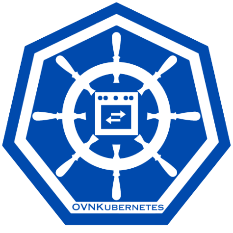

# OVN-Kubernetes: A Robust Kubernetes Networking Provider

OVN-Kubernetes (Open Virtual Networking - Kubernetes) is an open-source project
that provides a robust networking solution for Kubernetes clusters with
OVN (Open Virtual Networking) and Open vSwitch (Open Virtual Switch) at its core.
It is a Kubernetes networking conformant plugin written according to the
CNI (Container Network Interface) specifications.

## Challenges for Cluster Networking in Kubernetes Ecosystem

* Kubernetes at its core is a bunch of powerful APIs like Pods, Services, EndpointSlices
  and NetworkPolicies.
    * If we look at [The Kubernetes Network Model](https://kubernetes.io/docs/concepts/services-networking/)
    it imposes a set of fundamental requirements for how networking is expected
    to behave for pods in a cluster.
    * At the end of the day we need a robust networking platform to fulfill
    those requirements.
* Handling complicated telco and enterprise networking scenarios.
    * Kubernetes Cluster Networking Model addresses the basic set of problems
    such as communication between containers in a pod, communication between pods,
    allowing external (outside the cluster) entities to talk to pods via services,
    ingress and gateway-api on a primary network level using clusterCIDRs and
    serviceCIDRs.
    * However when we start talking about more powerful networking abstractions like
    secondary networks, multi-homing and more fine grained cluster egress controls
    outside the normal node SNATing the Kubernetes Networking Model falls short
* Lifecycle management of networking infrastructure.
    * In addition to having an implementation that fulfills the basic requirements
    of the Kubernetes Networking model, we also need a level driven controller that
    automatically takes care of the lifecycle and health of the critical networking
    aspects.
* Networking on Kubernetes is not simple.
    * There are complicated features such as service traffic policies, terminating
    endpoints, topology aware hints which involve multiple moving pieces and
    components that needs a "driver" that ensures they work as expected.

## What is OVN-Kubernetes?

OVN-Kubernetes was designed to precisely solve the above problems in a Kubernetes
cluster. The OVN-Kubernetes plugin watches the Kubernetes API. It acts on the
generated Kubernetes cluster events by creating and configuring the corresponding
OVN logical constructs in the OVN database for those events. OVN (which is an
abstraction on top of Open vSwitch) converts these logical constructs into logical
flows in its database and programs the OpenFlow flows on the node, which enables
networking on a Kubernetes cluster.

The key functionalities and features that OVN-Kubernetes provides include:

- Kubernetes Core Networking Conformance
    - Creates pod networking including IP Address Management (IPAM) allocation
    and virtual ethernet (veth) interface for the pod.
    - Programs overlay based networking implementation for Kubernetes clusters
    using Generic Network Virtualization Encapsulation GENEVE tunnels that
    enables pod-to-pod communication.
    - Implements Kubernetes Services & EndpointSlices through OVN Load Balancers.
    - Implements Kubernetes NetworkPolicies and AdminNetworkPolicies through
    OVN Access Control Lists (ACLs).
    - Supports IPv4/IPv6 Dual-Stack clusters.
- Fine grained Cluster Egress Traffic Controls
    - Multiple External Gateways (MEG) allows for multiple dynamically or statically
    assigned egress next-hop gateways by utilizing OVN ECMP routing features.
    - Implements Quality of Service (QoS) Differentiated Services Code Point (DSCP)
    for traffic egressing the cluster through OVN QoS.
    - Provides ability to send egress traffic from cluster workloads using an
    admin-configured source IP (EgressIP) to outside the cluster using OVN Logical
    Router Policies and Network Address Translations.
    - Provides ability to send egress traffic from cluster workloads using the service
    load balancer IP (EgressService) to outside the cluster using OVN Logical
    Router Policies and Network Address Translations.
    - Provides the ability to restrict egress traffic from cluster workloads
    (Egress Firewall) using OVN Access Control Lists.
- Advanced Networking Features
    - Implements Hybrid Networking to provide support for mixed Windows/Linux
    clusters using VXLAN tunnels.
    - Provides IP Multicast using OVN IGMP snooping and relays.
    - Provides ability to offload networking tasks from CPU to NIC using OVS Hardware
    Offload thus providing increased data-plane performance.
    - Adds support for creating secondary and local networks in addition to the
    default primary networks

## Why choose OVN-Kubernetes in Kubernetes ecosystem?

Networking is the backbone for any Kubernetes cluster. Kubernetes at its core
provides an extensive set of Networking APIs and features that need to
be implemented in a Kubernetes conformant manner for networking to work properly
in a Kubernetes cluster. The aim of OVN-Kubernetes project is to be able to
provide a pluggable and seamless networking platform for Kubernetes end users.
The project focuses strictly on enhancing networking for the Kubernetes platform
and includes a wide variety of features that are critical to enterprise and
telco users. OVN-Kubernetes community members are active in upstream Kubernetes
(particularly in SIG Network) to create new features and then realize them in
OVN-Kubernetes. In addition to a feature rich platform, the project also aims
to be a highly scalable and performant Networking Platform.

For more details, please see the following:

- [OVN-Kubernetes Architecture](https://ovn-kubernetes.io/design/architecture/)
- [Deploying OVN-Kubernetes cluster using KIND](installation/launching-ovn-kubernetes-on-kind.md)
- [Deploying OVN-Kubernetes CNI using Helm](installation/launching-ovn-kubernetes-with-helm.md)
- [Setup and Building OVN-Kubernetes](developer-guide/documentation.md) for instructions
  on setting up your development environment and building ovn-kubernetes.
- [Contributing to OVN-Kubernetes](governance/CONTRIBUTING.md) for how to get involved
  in our project
- [Meet the Community](governance/MEETINGS.md) for details on community
  meeting details.
