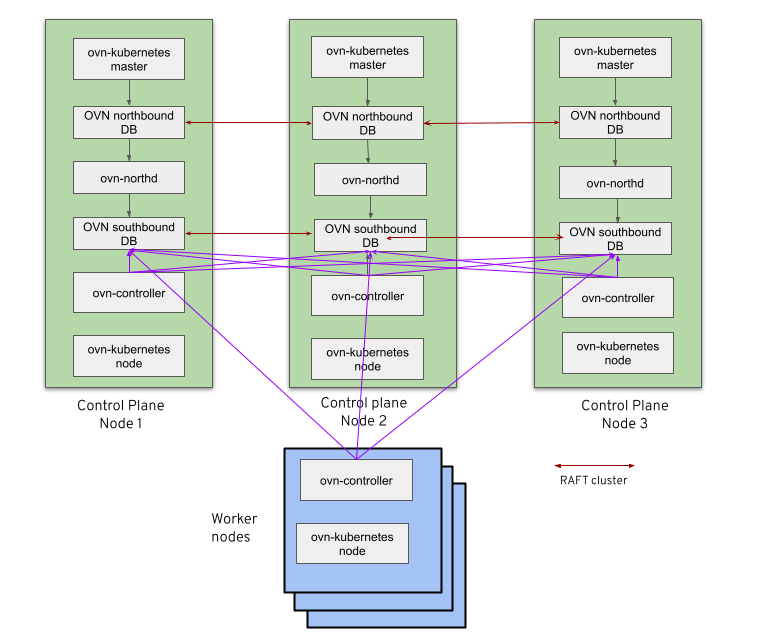
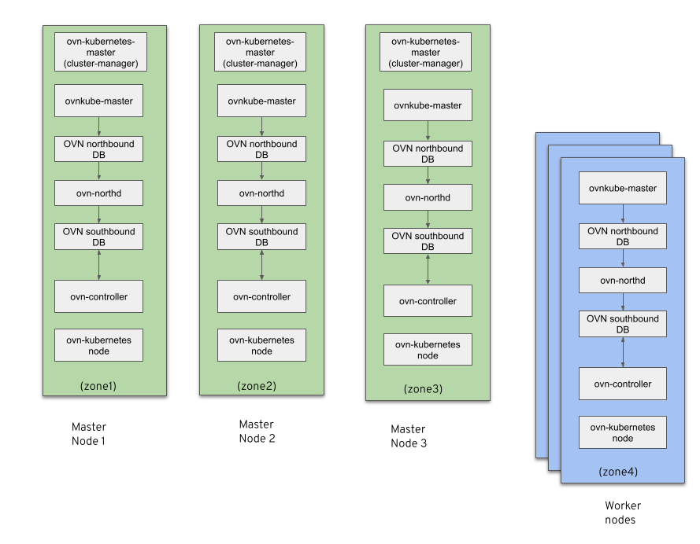

# OVN-Kubernetes Interconnect Feature

## Introduction

### What is Interconnect?

OVN Interconnection (https://docs.ovn.org/en/latest/tutorials/ovn-interconnection.html) is a feature that allows connecting multiple OVN deployments with OVN managed GENEVE tunnels. Native ovn-ic feature allows for an `ovn-ic`, OVN interconnection controller, that is a centralized daemon which communicates with global interaction databases (IC_NB/IC_SB) to configure and exchange data with local NB/SB databases for interconnecting with other OVN deployments. See https://man7.org/linux/man-pages/man8/ovn-ic.8.html for more details.

### Adopting OVN-Interconnect into OVN-Kubernetes

In order to effectively adapt the capabilities of the interconnect feature in the kubernetes world, ovn-kubernetes components will replace `ovn-ic` daemon. Also note that the term `zone` which will be used heavily in these docs just refers to a single OVN deployment.

### Why do we need Interconnect in OVN-Kubernetes?

There are two main motivations behind using interconnect in ovn-kubernetes plugin.

* Scale: The centralized OVN architecture creates bottlenecks for scale and inspite of heavy optimizations done in the past, we cannot scale beyond a particular point. OVNK-Interconnect's distributed architecture is expected to help with this.

* Managed SaaS: In scenarios where the central infrastructure management and workloads are hosted as separate clusters, we want to prevent workload clusters from needing to reach out to control plane components. OVNK-Interconnect's distributed architecture where the `ovn-controller` will need to communicate only with its `local SBDB` is expected to help with this.

The overall goal is to simplify control plane architecture.

## OVN-Kubernetes Components - Centralized

The centralized architecture in OVN-K looks like this today:

The control plane has the following components running:

* ovnkube-master pod
  * ovnkube-master container: That talks to kube API service and converts the k8s objects into NBDB logical elements and inserts them into the north bound database using libovsdb client.
  * nbdb container: Runs the OVN NBDB database
  * northd container: Convers the OVN logical elements in NBDB into logical flows and writes them into SBDB
  * sbdb container: Runs the OVN SBDB database
* ovnkube-node pod
  * ovn-controller container: Talks to OVN SBDB and programs openflows corresponding to the logical flows present in SBDB.
  * ovnkube-node container: Does the required veth plumbing for pod creation, handles the CNI add/del commands and programs the necessary iptables and gateway modes on a per node basis.

The data plane only has the `ovnkube-node` pod running.

## OVN-Kubernetes Components - Distributed - Interconnect

The interconnect architecture in OVN-K looks like this today (we assume each node is in a zone of their own):

The control plane has the following components running:

* ovnkube-master pod
  * ovnkube-cluster-manager container: This is responsible for allocating the hostsubnets per node and giving out the join subnet IP and transit switch port IPs to each node in the cluster.
* ovnkube-zone pod
  * ovnkube-network-controller container: That talks to kube API service and converts the k8s objects into NBDB logical elements and inserts them into the north bound database using libovsdb client.
  * nbdb container: Runs the OVN NBDB database
  * northd container: Convers the OVN logical elements in NBDB into logical flows and writes them into SBDB
  * sbdb container: Runs the OVN SBDB database
* ovnkube-node pod
  * ovn-controller container: Talks to OVN SBDB and programs openflows corresponding to the logical flows present in SBDB.
  * ovnkube-node container: Does the required veth plumbing for pod creation, handles the CNI add/del commands and programs the necessary iptables and gateway modes on a per node basis.

The data plane only has both the `ovnkube-zone` and `ovnkube-node` pod running. Thus as we can see, the databases, northd and ovnkubernetes master components now run per zone rather than only on the control-plane. Note that there is no different to OVS between the two models

## References

* https://docs.google.com/presentation/d/1oheEPvgIy9lcvKy9aLudKOLKEZnrLYTiQoxDxXdjjAc/edit#slide=id.gfb215b3717_0_3299
* https://docs.ovn.org/en/latest/tutorials/ovn-interconnection.html
* https://man7.org/linux/man-pages/man8/ovn-ic.8.html