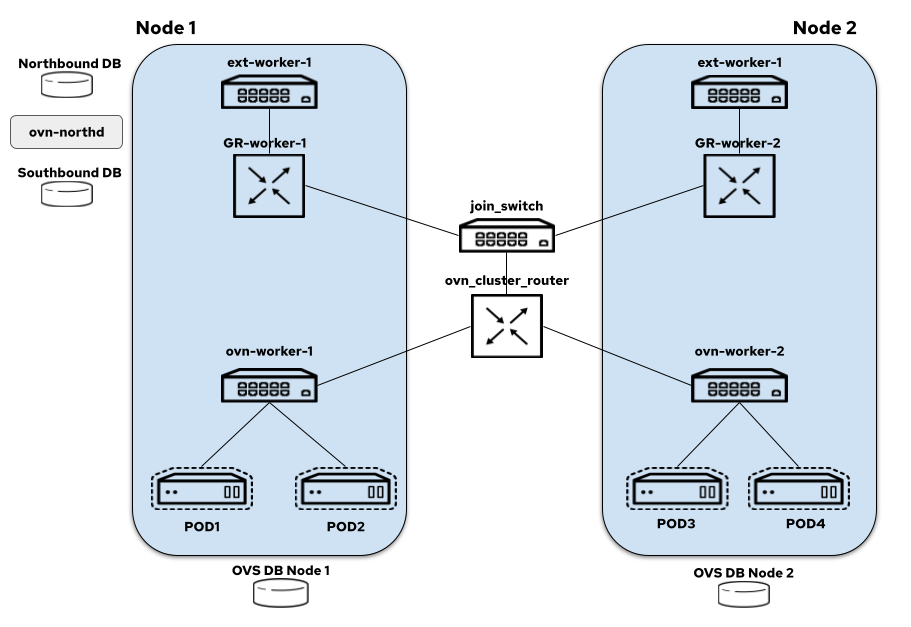
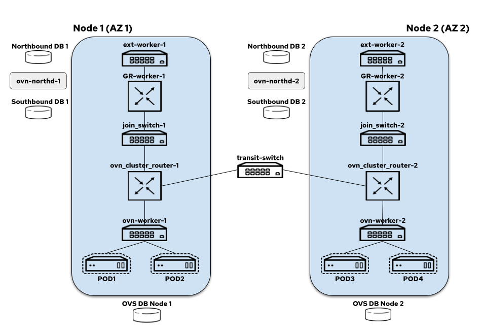

# OVN-Kubernetes Interconnect Feature

Let us look at how the network topology changes when going from a centralized model to a distributed model.

## OVN-Kubernetes Network Topology - Centralized

The centralized architecture in OVN-K looks like this today:

On each node we have:

* node-local-switch: all the logical switch ports for the pods created on a node are bound to this switch and it also hosts load balancers that take care of DNAT-ing the service traffic
* distributed-ovn-cluster-router: it's responsible for tunnelling overlay traffic between the nodes and also routing traffic between the node switches and gateway router's
* distributed-join-switch: connects the ovn-cluster-router to the gateway routers
* node-local-gateway-router: it's responsible for north-south traffic routing and connects the join switch to the external switch and it also hosts load balancers that take care of DNAT-ing the service traffic
* node-local-external-switch: connects the gateway router to the external bridge

## OVN-Kubernetes Network Topology - Distributed (Interconnect)

The interconnect architecture in OVN-K looks like this today (we assume each node is in a zone of their own):

On each node we have:

* node-local-switch: all the logical switch ports for the pods created on a node are bound to this switch and it also hosts load balancers that take care of DNAT-ing the service traffic
* distributed-ovn-cluster-router: it's responsible for tunnelling overlay traffic between the nodes and also routing traffic between the node switches and gateway router's (note that if its one node per zone this behaves like a local router since there is no need for a distributed setup; if there are multiple nodes in the same zone, then it uses GENEVE tunnel for overlay traffic)
* distributed-join-switch: connects the ovn-cluster-router to the gateway routers (note that if its one node per zone this behaves like local switch since there is no need for a distributed setup; if there are multiple nodes in the same zone, then its distributed and connects cross more than one gateway router)
* node-local-gateway-router: it's responsible for north-south traffic routing and connects the join switch to the external switch and it also hosts load balancers that take care of DNAT-ing the service traffic
* node-local-external-switch: connects the gateway router to the external bridge
* transit-switch: This is the shiny new component coming in for IC. It is distributed across the nodes in the cluster and is responsible for routing traffic between the different zones.

## References

* https://docs.google.com/presentation/d/1BtkYAO30gI3v6ah2hS6XTGtt6JBHNRHh64vhGEtfLEM/edit#slide=id.gfb215b3717_0_3299
