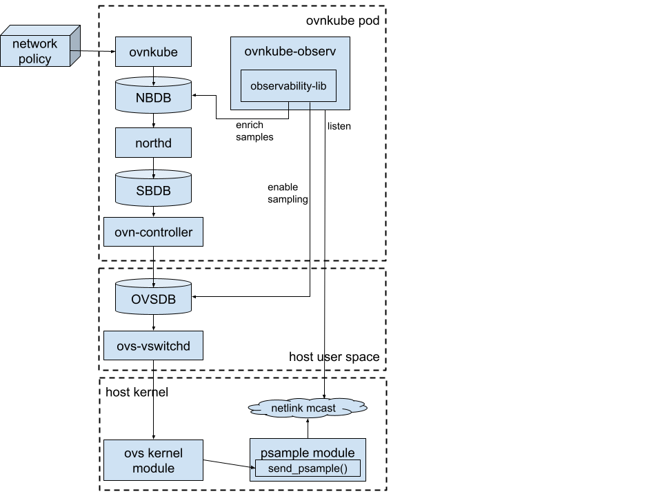

# Observability

## Introduction

Observability feature uses OVN sampling functionality to generate samples with requested metadata when
specific OVS flows are matched. To see the generated samples, a binary called `ovnkube-observ` is used.
This binary allows printing the samples to stdout or writing them to a file.

Currently, supports observability for:
- Network Policy
- (Baseline) Admin Network Policy
- Egress firewall
- UDN isolation
- Multicast ACLs

More features are planned to be added in the future. 

## Motivation

Networking observability is an important feature to verify the expected networking behavior in a cluster and
to debug existing problems.
Ovn-kubernetes makes use of many abstraction layers (through NBDB, logical flows, openflow flows and datapath flows) 
that translate kubernetes feature into very specific rules that apply 
to each packet in the network. Therefore, even though there are ways to see what OVS/OVN is doing with a particular packet, 
there is no way to know why.

We aim to solve this problem by providing a way for ovn-kubernetes to generate packet samples enriched with metadata 
that can be easily correlated back to kubernetes objects or other human-readable pieces of information that provide 
insights of what ovn-kubernetes is doing with a packet and why.

### User-Stories/Use-Cases

- As a user I want to make sure that the network policies/egress firewalls/etc. are correctly enforced in my cluster.
- As a cluster admin I want to check why some traffic is allowed or dropped.

## How to enable this feature on an OVN-Kubernetes cluster?

To enable this feature, use `--observability` flag with `kind.sh` script or `--enable-observability` flag with `ovnkube` binary.

To see the samples, use `ovnkube-observ` binary, use `-h` to see allowed flags.

This feature requires OVS 3.4 and linux kernel 6.11.

As of Aug 2024, the kernel need to be built from the source, therefore to try this feature you need to:
- rebuild the kernel with the current master branch from [Linus' tree](https://git.kernel.org/pub/scm/linux/kernel/git/torvalds/linux.git)
  - to rebuild on fedora: https://docs.fedoraproject.org/en-US/quick-docs/kernel-build-custom/#_building_a_vanilla_upstream_kernel
- Build an ovn-kubernetes image that uses the latest OVS/OVN code:
`OVS_BRANCH=main make -C dist/images fedora-dev`
- Start kind with that image, use `-ov localhost/ovn-kube-fedora-dev:latest` flag with `kind.sh` script.

## Workflow Description

- Observability is enabled by setting the `--enable-observability` flag in the `ovnkube` binary.
- For now all mentioned features are enabled by this flag at the same time.
- `ovnkube-observ` binary is used to see the samples. Samples are only generated when the real traffic matching the ACLs
is sent through the OVS. An example output is:
```
OVN-K message: Allowed by default allow from local node policy, direction ingress
src=10.129.2.2, dst=10.129.2.5
```

## Implementation Details

### User facing API Changes

No API changes were done.

### OVN sampling details

OVN has 3 main db tables that are used for sampling:
- `Sample_collector`: This table is used to define the sampling collector. It defines the sampling rate and collectorID, 
which is used to set up collectors in the OVS. 
- `Sampling_app`: This table is used to set `ID`s for existing OVN sampling applications, that are sent together with the samples.
- `Sample`: This table is used to define required samples and point to the collectors. 
Every sample has `Metadata` that is sent together with the sample.

Samples are attached to the other db tables, for now only to ACLs.
A sample is generated when a packet matches the ACL. Every Sample contains `Sampling_app.ID` and `Sample.Metadata`,
that is decoded by `go-controller/observability-lib`.

### OVN-Kubernetes Implementation Details

`Sample_collector` and `Sampling_app` are created or cleaned up when the observability is enabled/disabled on startup.
When one of the supported objects (for example, network policy) is created, ovn-kuberentes generates an nbdb `Sample` for it.

To decode the samples into human-readable information, `go-controller/observability-lib` is used. It finds `Sample`
by the attached `Sample.Metadata` and then gets corresponding db object based on `Sampling_add.ID` and `Sample.UUID`.
The message is then constructed using db object `external_ids`.

### Full stack architecture



The diagram shows how all involved components (kernel, OVS, OVN, ovn-kubernetes) are connected.

## Best Practices

TDB

## Future Items

Add more features support, for example, egress IP or load balancing.

## Known Limitations

Current version of `ovnkube-observ` only works in OVN-IC mode, as it requires `nbdb` to be available locally via unix socket.
In the future non-IC will also be supported with provided `nbdb` address and certificates.

Only default network observability is supported for now, secondary-network observability will be added later.

Sample ID for ACL is stored in conntrack when the new session is established and is never updated until the session is closed.
That means, some samples may be removed from nbdb, but still be present in the generated samples. It implies:
- ACL-based sampling only affects newly established connections: if a session was already established before the sampling was enabled,
the session will not be sampled.
- If a session is established with enabled sampling, disabling sampling won't affect that session, and it will continue
generating samples until the session is closed.
- If the sample was removed from nbdb (e.g. when sampling is disabled for a given connection or when ACL is updated on network policy
update or delete) generated samples won't be decoded, as required data is not present in nbdb anymore.

Due to OVN limitations, some samples can only be generated on the first packet of a connection.
This applies to 
- egress firewall, as it doesn't submit a flow to conntrack.
- multiple ACLs on the same direction, as only last-tier ACL will be submitted to conntrack. For now this applies to 
  - ANP + network policy
  - ANP + BANP 
  
  in both cases ANP will have only first-packet sample.

## References

NONE
