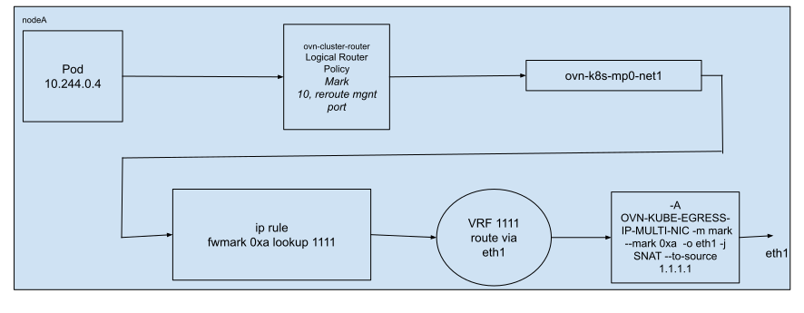
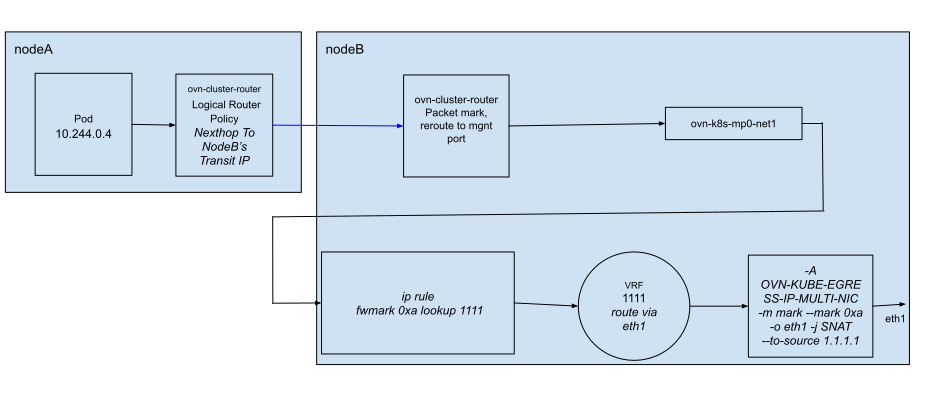

# OKEP-4456: EgressIP support on user defined networks

* Issue: [#4456](https://github.com/ovn-org/ovn-kubernetes/issues/4456)

## Problem Statement

OVN-Kubernetes today allows multiple different types of networks per secondary network: layer 2, layer 3, or localnet.
Pods can be connected to different networks without discretion. For the primary network, OVN-Kubernetes only supports
all pods connecting to the same layer 3 virtual topology.
There is a separate effort to bring the same flexibility of the secondary network to the primary network.
Therefore, a pod is able to connect to a single primary network of layer3 or layer2.
It is also able to connect to localnet but this is out of scope for this enhancement.

This enhancement details the support of EgressIP for layer 3 and layer 2 topologies for role primary user defined networks.
A role primary user defined network must include the key "role" in a network attachment definition:
```yaml
apiVersion: k8s.cni.cncf.io/v1
kind: NetworkAttachmentDefinition
metadata:
  name: nad1
  namespace: egressip-namespace
spec:
  config: |2

    {
            "cniVersion": "0.3.0",
            "name": "network1",
            "type": "ovn-k8s-cni-overlay",
            "topology":"layer2",
            "subnets": "10.20.0.0/16",
            "mtu": 1300,
            "netAttachDefName": "egressip-namespace/nad1",
            "role": "primary"
    }
```

## Goals

- Provide a mechanism to configure EgressIP for a pod which is served by a role primary user defined primary network.
Since the cluster default network will also be attached and will only be used for kAPI & DNS access, therefore we will not
configure the cluster default network for EgressIP if the pod is also attached to a role primary user defined network.
- Ensure existing EgressIP functionality works when the cluster default network is the primary network.
- EgressIP support for both layer 2 and layer 3 role primary user defined networks.
- EgressIP support for role primary user defined networks in both shared and local gateway modes.
- EgressIP support for role primary user defined networks when the EgressIP is assigned to a secondary host interface.

## Non-Goals

- Support EgressIP on non-primary user defined networks.

## Introduction

For more information about supporting user defined networks in OVN-Kubernetes, refer to this [link](https://github.com/trozet/enhancements/blob/multiple_networks/enhancements/network/user-defined-network-segmentation.md).

Today, we can get a deterministic pod source IP when traffic egresses a Kubernetes Node using the EgressIP feature.
OVN logical router policies are created within OVN Logical Router (LR) `ovn_cluster_router` which steer traffic towards the interface we wish to egress.
There are two different routing policies on egress nodes depending on which interface we wish to egress:
- When an EgressIP IP is assigned to the nodes host primary interface, a pods packet is sent towards the chosen egress nodes
OVN Gateway Router (GR) and then the packets are SNAT’d by that GR to the egress IP, and sent to br-ex.
- When an EgressIP IP is assigned to a host secondary interface, a pods packet is sent to the nodes management port and from there it is routed towards the assigned interface and SNAT'd by the kernel networking stack.

The role primary user defined networks serving namespaces can have overlapping IP subnets (but not with the cluster default IP subnet),
also in case of L2 user defined networks, there is no OVN LR `ovn_cluster_router` and join switch to connect pod logical network with a nodes GR.
So EgressIP used today for the cluster default primary network will need changes so that it can also work with role primary user defined networks.

## User-Stories/Use-Cases
#### Story 1

As a user of OVN-Kubernetes, I should be able to utilize the EgressIP feature for primary user defined L2/L3 networks.

#### Story 2

As a user of OVN-Kubernetes, I should be able to utilize the EgressIP high availability feature for primary user defined L2/L3 networks.

#### Story 3

As a user of OVN-Kubernetes, I should be able to utilize the EgressIP feature for pods which only have connectivity to the cluster default network.

#### Story 4

As a user of OVN-Kubernetes, I should be able to continue EgressIP on pods where some sets of pods have a cluster default network as their primary network while other sets of pods have user defined networks as their primary network.

#### Story 5

As a user of OVN-Kubernetes, I should be able to utilize the EgressIP feature to allow consistent source IP when egress-ing secondary host interfaces from pods which have connectivity to primary user defined networks.

## Proposed Solution

The EgressIP should work seamlessly irrespective of whether the pod is either managed by a primary cluster default network or primary user defined networks
or overlapping subnets being used in user defined networks across namespaces, the same EgressIP is used to manage different user defined networks, etc.
From a user perspective this should not have any impact on EgressIP at API level. At the same time this poses some challenges for EgressIP in the data plane to send and receive pod egress traffic.

Consider the scenario, podA and podB assigned with same IP address 10.244.0.8, but assigned from different user defined networks (say from netA and netB),
both pods are served by same EgressIP 1.1.1.1, now two pods are trying to connect externally using the same source and destination port,
when SNAT happens on OVN's Gateway Router (GR), both pod traffic would have same 5-tuple and collision happen at br-ex.
To avoid this, SNAT must be moved from OVN gateway router into br-ex  with appropriate flow rules to avoid the collision.

When traffic from both EgressIP and Non-EgressIP pods arrive at br-ex with GR masquerade IP used as the source IP address,
there should be a way to distinguish which packets require SNAT for EgressIP, otherwise it would be SNATed with the node's IP address.
The EgressIP pod is packet marked using OVN's Logical Router Policy (LRP) and flow rule in br-ex match on `pkt_mark` to apply SNAT.

The packet mark used to mark packets is gather from the EgressIP custom resource. It is added to the EgressIP custom resources
annotations by OVN Kubernetes Cluster Manager. The mark added to the annotations is immutable for the lifetime of the custom
resource.

The mark added to the annotations is an integer and its bounds are defined when instantiating the following:
```go
const (
    EgressIPMarkBase       = 50000
    EgressIPMarkMax        = math.MaxUint16
)
```
Note: `math.MaxUint16` resolves to 65535.

Therefore, a maximum of 15525 EgressIP custom resources are supported when utilizing user defined networks.
The allocator is a round-robin allocator.

We do not require a packet mark per IP specified within each EgressIP CR because only one IP is assigned per node per EgressIP CR.
Packet mark allocation must not conflict with other features using packet marks, and is bounded by a specific integer range defined by
the linux kernel and also not conflict with other features utilizing packet marks.

There isn't a reliable way for each node controller to generate a deterministic packet mark based on the constraints mentioned previously
for each EgressIP CR.

Packet marks (integer) will be centrally allocated by a cluster manager managed allocator and annotated on each EgressIP CR.
If cluster manager restarts or another instance takes over, it can rebuild its allocator cache from the existing EgressIP CRs.

The node controllers will refer to this integer to determine the packet mark for a given EgressIP CR to generate OVS flows
predicated on matching this integer, generating logical router policies to redirect a packet to an egress node or mark
packets using logical router policies attached to the OVN gateway routers.

As stated previously, this mark will be used in an OVS flow to SNAT to an EgressIP,
where-as with the cluster default network we SNAT to the EgressIP using a logical router policy attached to the egress nodes
OVN gateway router. There is no proposed change in this enhancement to change the OVN configuration for the cluster default
network.

The consequence of using packet marks to decide whether to SNAT to an EgressIP is that the packet marks do no persist when
a packet traverses Nodes, therefore for all supported role primary user defined network topologies, we create a logical
router policy attached to the egress nodes gateway router to packet mark packets from selected pods. This ensures when selected
pods packets are egressing nodes, the packet mark is applied to the packets `sk_buff`.

### EgressIP assigned to the host primary interface 
#### Layer 3
A similar configuration for the cluster default network is applied for layer 3 user defined networks. A single difference occurs
on the egress nodes gateway logical router policies. Instead of a SNAT entry matching on the selected pod IPs, we replace this with a
logical router policy to packet mark and the source NAT'ing is moved to br-ex OVS flows.

One EgressIP IP assigned and remote egress node:


Two EgressIP IPs assigned and remote egress nodes:


#### Layer 2
Layer 2 networks must have at least one subnet of the same IP family as the defined EgressIP IP.
For layer two, the "redirect" logical router policies that would exist on an `ovn_cluster_router` for the default cluster network
that would support EgressIP are now attached to each Nodes OVN gateway router. If an EgressIP custom resource contains greater than
one IP, the resultant logical router policy to support this EgressIP custom resource will also have greater than one next hop IPs.
If the next hop IP is remote, then the IP will be a router to switch port IP for the route Nodes OVN gateway router.
If the next hop IP is local, then the IP will be fetched from the Nodes annotations `k8s.ovn.org/l3-gateway-config"`.

One EgressIP assigned and egress node is local:


#### Breth0 flows
Create one flow per EgressIP per user defined network in `Table 0` matching on `pkt_mark` with actions `snat(<EIP>, zone 0, CT Mark 5, table=0)`:
```
 cookie=0xdeff105, duration=2912.269s, table=0, n_packets=0, n_bytes=0, idle_age=2912, priority=105,pkt_mark=0xc356,ip,in_port=9,dl_src=02:42:ac:12:00:02 actions=ct(commit,zone=64000,nat(src=172.18.0.40),exec(load:0xa->NXM_NX_CT_MARK[])),output:1
```
The flows are created per EgressIP per user defined network even if no pods are selected that are attached to said network.

### EgressIP assigned to a secondary host interface

#### Layer 3
A similar configuration for the cluster default network is applied for layer 3 user defined networks. A single difference occurs
for the OVN logical router `ovn_cluster_router` logical router policies which will now gather the packet mark stated in the EgressIP custom resource
annotations and configure OVN to packet mark and redirect packets to an egress nodes management port.

#### Layer 2
Logical router policies implementing reroute action and packet marking will occur on the nodes OVN gateway router instead of a non-existing `ovn_cluster_router` for layer 2.

#### Host network namespace configuration
On an egress node, the IP rule on the host which matches on packet marking, then forwards the packet a custom routing table:

```
999:	fwmark 0xa lookup 1111
```

The existing IP rule to skip Non-Egress IP pod and host networked pod traffic to go over via custom routing table is no
longer needed because of packet marking now. This can be safely removed.

```
5999:	from all fwmark 0x3f0 lookup main
```

The EgressIPs assigned to secondary interfaces IP rule priorities need to be higher than the VRF IP rule:

```
 1000:	from all lookup [l3mdev-table]
 ```

EgressIP hosted by a secondary host interface uses a routing table per egress interface.
This approach can be continued for CDN and UDN networks.

```
sh-5.2# ip route show table 1111
default dev eth1
```

The IPTable entry in OVN-KUBE-EGRESS-IP-MULTI-NIC chain would be changed to match only on packet mark and SNAT to the associated EgressIP address.
This alleviates the need for IPTable entry per pod.

```
-A OVN-KUBE-EGRESS-IP-MULTI-NIC -m mark --mark 0xa -o eth1 -j SNAT --to-source 1.1.1.1
```

One EgressIP IP and local node is egress node:


One EgressIP IP and remote node is egress node:


### Testing Details
- At least the equal or greater e2e coverage as the cluster default network

### Documentation Details

## Risks, Known Limitations and Mitigations

### Upgrade risks for both IC / non-IC for Cluster Default Network

The upgrade may have a minimal impact for a shorter period of time particularly for pod's egress traffic for both primary and secondary EgressIPs.
For primary EgressIP, the new design has to reconcile existing ovn-cluster-router LRPs and ovn-gateway-router SNATs with new LRPs and corresponding br-ex SNAT entries.
For secondary EgressIP, it has to reconcile existing ip rule and IPTable rules because the new rules match only on packet marking.

This impact on primary EgressIP may be solved by making EgressIP resync logic to create br-ex SNAT entries, LRP on ovn-gateway-router for packet marking first and then delete existing ovn-gateway-router SNATs.

## OVN Kubernetes Version Skew

## Alternatives

## References
